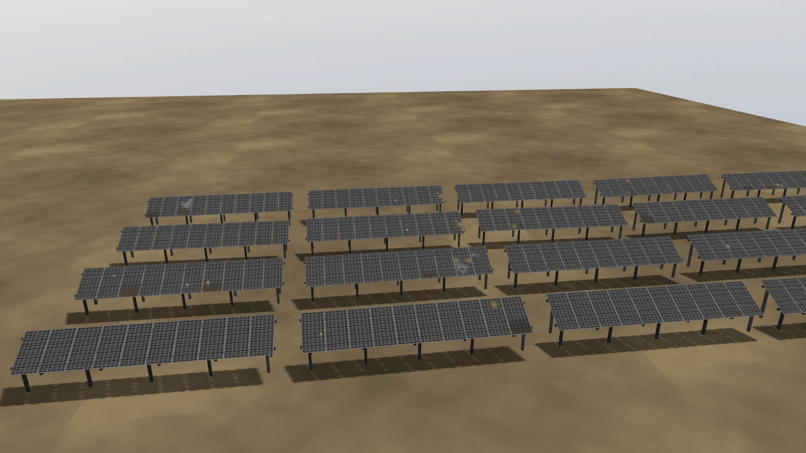
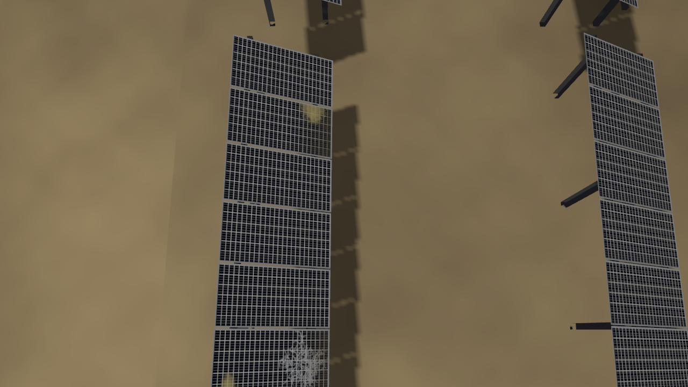
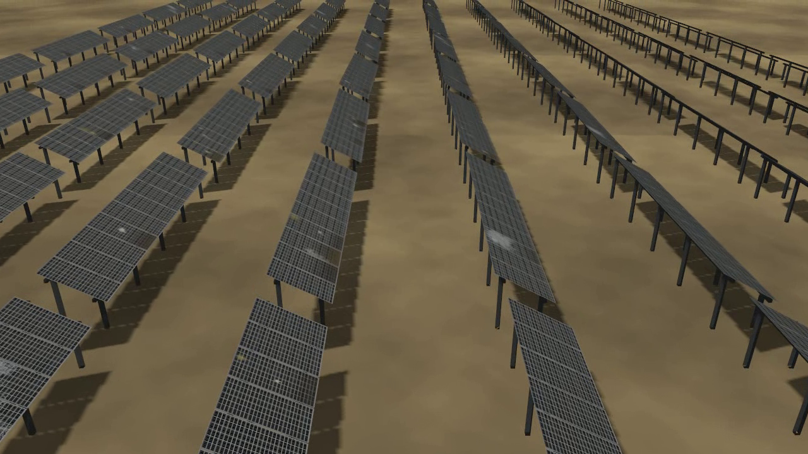
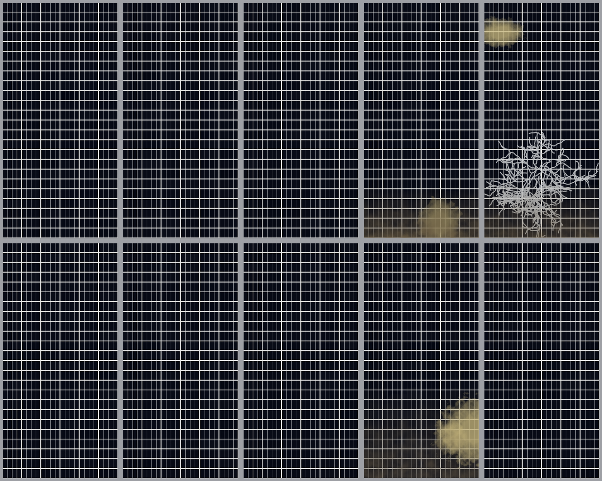
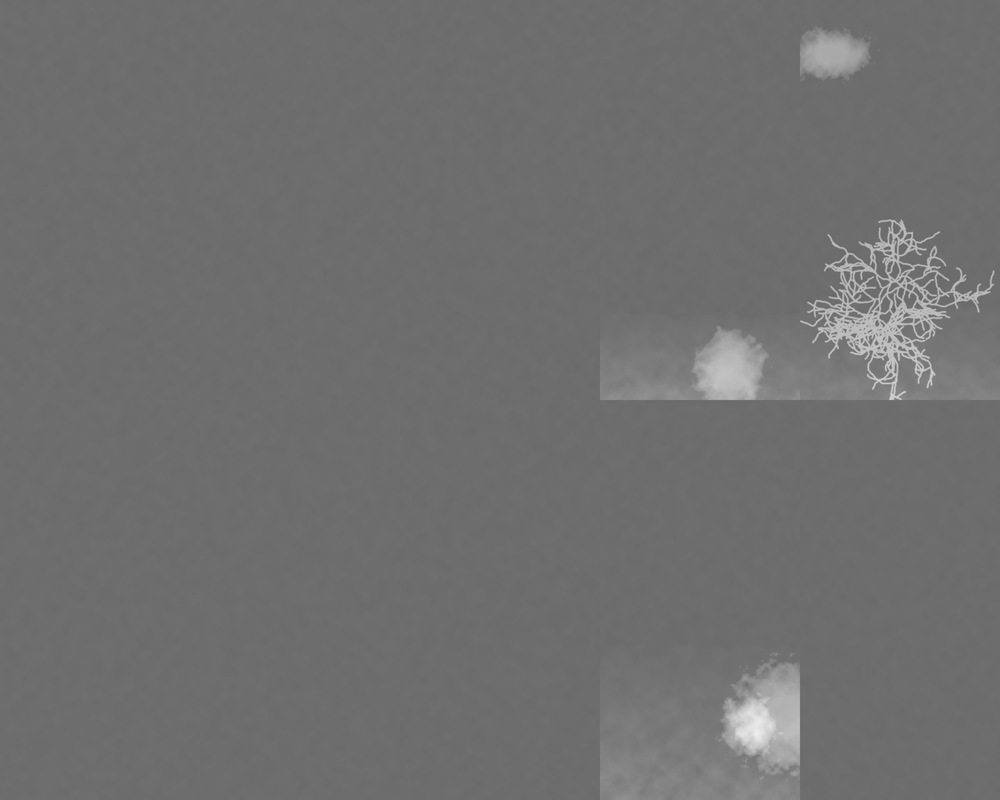
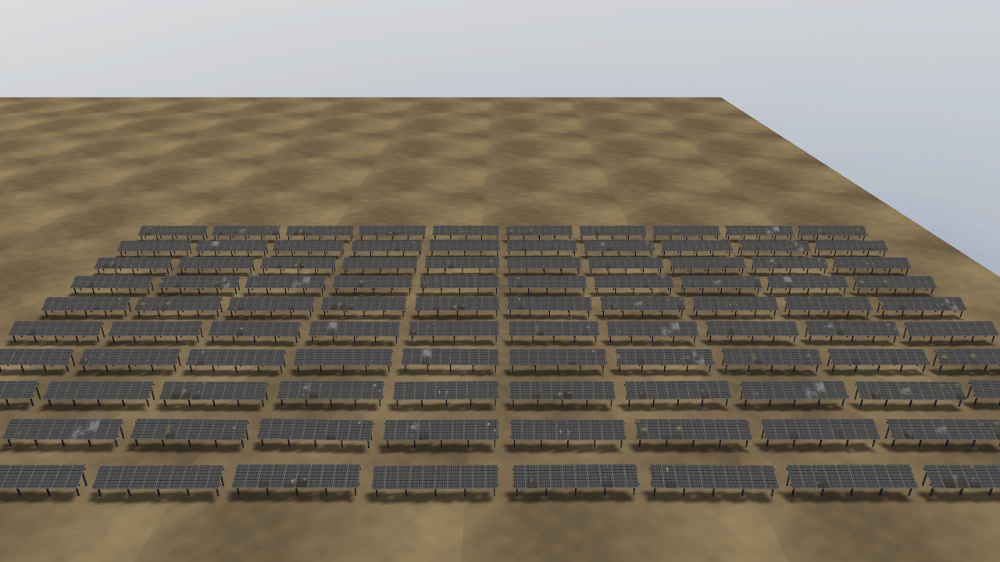

# solar_farm_gz

Mundos de parques solares fotovoltaicos generados proceduralmente para
**Gazebo Harmonic** y **ROS 2 Jazzy**, construidos para investigación de
inspección aérea.

Proyecto open source de **EuropeSIP Communications S.L.** — empresa
especializada en Transformación Digital, Portales e Inteligencia
Artificial — para explorar las posibilidades de la IA en un campo tan
relevante como el reconocimiento de imagen y las decisiones basadas en
visión aplicadas a la ingeniería. Más información sobre las soluciones de
IA de EuropeSIP en
[europesip.com/es/europesip/soluciones/inteligencia-artificial](https://www.europesip.com/es/europesip/soluciones/inteligencia-artificial).

## Contexto y motivación

El objetivo concreto de este proyecto: simular el vuelo de un dron de
inspección sobre un parque solar fotovoltaico capaz de detectar defectos en
los paneles — suciedad, grietas, delaminación, excrementos de aves — de
forma automática y sin intervención manual, usando **YOLO** y **OpenCV**
para el reconocimiento de imagen.

El plan original no era este. La idea inicial era hacerlo con un dron
real: construirlo desde cero, montar los sensores necesarios — incluida una
cámara termográfica, clave para detectar puntos calientes en celdas
dañadas — y volar sobre instalaciones fotovoltaicas reales para capturar y
etiquetar imágenes de defectos con las que entrenar un detector.

Ese plan se topó pronto con varias dificultades, cada una suficiente por sí
sola para hacer descarrilar el proyecto:

- **El coste del equipo.** Una cámara termográfica con resolución
  suficiente para detectar puntos calientes en un panel dañado no es
  barata, y se suma al resto del material necesario: chasis, controlador
  de vuelo, cámara RGB, enlace de vídeo, baterías, repuestos por si algo se
  rompe en un vuelo de pruebas... para un prototipo, ese presupuesto deja
  de ser trivial muy rápido.
- **El acceso legal a instalaciones.** Volar un dron sobre una planta
  fotovoltaica real, cumpliendo la normativa de aviación civil vigente
  (autorizaciones, restricciones de espacio aéreo, seguros de
  responsabilidad civil), no es un trámite rápido ni sencillo — y la
  inmensa mayoría de instalaciones son propiedad privada, con su propio
  control de acceso.
- **Encontrar paneles realmente dañados.** Incluso resolviendo los dos
  puntos anteriores, hace falta una instalación con defectos reales,
  variados y en cantidad suficiente para poder entrenar y evaluar un
  detector — y, lógicamente, ningún operador de una planta solar tiene
  paneles rotos o sucios esperando a que alguien los fotografíe para una
  demostración.

Ante ese escenario, la alternativa razonable quedó clara: si no se puede
llevar el dron hasta un parque solar dañado, se puede llevar el parque
solar — con sus defectos, y a demanda — hasta el dron, dentro de un mundo
simulado. Para eso se ha elegido simular el entorno con **Gazebo** y
**ROS 2** — herramientas que permiten simular con fidelidad el
comportamiento de robots industriales y drones — y así prototipar la
solución de extremo a extremo antes de depender de hardware real.

**Por qué la simulación con Gazebo y ROS 2 cubre esos huecos, y no es un
sustituto de segunda categoría:**

- Un parque solar generado proceduralmente no tiene coste de acceso ni de
  propietario: se genera con un único comando, con tantos defectos, tipos y
  niveles de severidad como haga falta, y tantas veces como haga falta.
- No hace falta comprar una cámara termográfica real para disponer de un
  canal térmico: el generador ya renderiza, junto a cada defecto, un canal
  de temperatura co-registrado píxel a píxel con el daño visible, y
  `flight_video.py --thermal` lo usa para simular una cámara térmica real
  en la señal de nadir grabada (ver [Canal térmico](#canal-térmico)), sin
  rehacer ningún recurso.
- No hace falta autorización de vuelo, seguro ni ventana meteorológica:
  Gazebo simula la física del entorno, y quien pilota el dron dentro de esa
  física es **ArduPilot SITL**, el mismo software de vuelo que llevaría un
  dron real — así que el comportamiento de vuelo observado es representativo
  del que tendría el dron físico, no una animación de cámara.
- La reproducibilidad es total: cada mundo generado trae su propia
  referencia (*ground truth*) exacta de cada defecto, sin necesidad de
  etiquetado manual, y se puede repetir con semillas distintas tantas veces
  como haga falta para construir un dataset de entrenamiento robusto y
  variado.

En resumen: la simulación no sustituye al dron real por falta de
ambición, sino que es la vía que permite completar el objetivo del
proyecto — entrenar y validar un sistema de detección de defectos sobre un
dron de inspección — sin depender del coste del equipo, de la burocracia de
vuelo ni de la disponibilidad de una instalación real ya dañada. Además del
mundo virtual donde volar el dron, este prototipo viene preparado para
generar el dataset de imágenes anotadas que después sirve como prueba de
concepto para entrenar el modelo de IA — el pipeline completo, de
principio a fin. El resto de este documento es la referencia técnica
completa de ese sistema.

---


El mundo completo — disposición de paneles, terreno, iluminación y cada
defecto de superficie — se produce mediante un generador en Python a partir de
una única semilla aleatoria. Volver a ejecutarlo con una semilla distinta
produce un parque distinto: diferentes tipos de defectos, en diferentes
lugares, con diferentes tamaños y orientaciones. Nada se coloca a mano, así
que un detector puede entrenarse con muchas variaciones del mundo sin trabajo
manual repetido.

Este repositorio,ademas de todo el material necesario, tiene diferentes guias para que puedas operarlo. En la  [guía para principiantes](docs/GETTING_STARTED.md) puedes ver desde las instrucciones de la instalación al
primer vuelo, paso a paso. El [RUNME](RUNME.md) es la referencia rápida para
lanzar la simulación y generar vídeos (demo o dataset/YOLO). Este README es
la referencia completa; la [metodología](docs/METHODOLOGY.md) cubre las
decisiones de diseño, y la [hoja de ruta](docs/ROADMAP.md) cubre las mejoras
opcionales que quedan abiertas.



---

## Contenido

- [solar\_farm\_gz](#solar_farm_gz)
  - [Contexto y motivación](#contexto-y-motivación)
  - [Contenido](#contenido)
  - [Qué te ofrece esto](#qué-te-ofrece-esto)
  - [Requisitos](#requisitos)
  - [Compilación](#compilación)
  - [Generar un mundo](#generar-un-mundo)
    - [Parámetros](#parámetros)
    - [Generar variaciones del dataset](#generar-variaciones-del-dataset)
  - [Ejecución](#ejecución)
  - [Volar el dron de inspección](#volar-el-dron-de-inspección)
    - [Configuración inicial (una sola vez)](#configuración-inicial-una-sola-vez)
    - [Lanzamiento](#lanzamiento)
    - [La aeronave](#la-aeronave)
    - [Qué ve la cámara](#qué-ve-la-cámara)
    - [Teleoperación con mando](#teleoperación-con-mando)
    - [Grabar un vuelo](#grabar-un-vuelo)
  - [Capturar imágenes y vídeos de vuelo](#capturar-imágenes-y-vídeos-de-vuelo)
  - [Anotaciones de referencia (ground truth)](#anotaciones-de-referencia-ground-truth)
  - [Cómo funciona](#cómo-funciona)
    - [Las llamadas de dibujo (draw calls) son la restricción principal](#las-llamadas-de-dibujo-draw-calls-son-la-restricción-principal)
    - [El conjunto de atlases](#el-conjunto-de-atlases)
    - [Los recursos son un paquete `model://`](#los-recursos-son-un-paquete-model)
  - [Modelo de defectos](#modelo-de-defectos)
  - [Canal térmico](#canal-térmico)
  - [Rendimiento](#rendimiento)
  - [Referencia de disposición](#referencia-de-disposición)
  - [Limitaciones conocidas](#limitaciones-conocidas)
  - [Licencia](#licencia)

---

## Qué te ofrece esto

| | |
|---|---|
| **Simulador** | Gazebo Harmonic (`gz-sim` 8), SDF 1.10 |
| **Middleware** | ROS 2 Jazzy, puente `ros_gz` |
| **Número de paneles** | parametrizable; 200 totalmente validado, 1000 validado con alternativas de respaldo |
| **Tipos de defecto** | suciedad, excrementos de aves, grietas en el vidrio, delaminación EVA |
| **Reparto limpio / dañado** | fijado con `--clean-ratio`, realizado con precisión de un módulo |
| **Referencia (ground truth)** | `defects.json` con el tipo de cada defecto y su caja delimitadora para usarlo direcctamente en YOLO y modelos de IA |
| **Térmico** | canal de temperatura renderizado junto a cada atlas de albedo; cámara térmica simulada disponible con `flight_video.py --thermal` |
| **Reproducibilidad** | una semilla determina el mundo por completo |
| **Emplazamiento** | valla perimetral, camino de servicio en anillo, estaciones de inversores |
| **Aeronave** | cuadricóptero clase Holybro X500 V2, ArduPilot SITL, cámara RGB en nadir |
| **Teleoperación** | mando USB a RC MAVLink, o grabación de trayectos autónomos |

---

## Requisitos

Ubuntu 24.04, con:

```bash
sudo apt install ros-jazzy-desktop ros-jazzy-ros-gz gz-harmonic \
                 python3-numpy python3-scipy python3-pil python3-opencv
```

El generador en sí solo necesita NumPy, SciPy y Pillow — puede ejecutarse sin
ROS si solo quieres el SDF y los recursos (assets).

Volar el dron necesita además ArduPilot SITL, el plugin `ardupilot_gazebo` y
`pymavlink`; ver
[Volar el dron de inspección](#flying-the-inspection-drone).

**Portátiles con gráficos conmutables.** Gazebo no solicita la GPU discreta,
así que en una máquina con adaptadores Intel y NVIDIA renderizará en la
integrada y simplemente irá más lento — el único síntoma es una línea
`libEGL ... dri2` en el log. Ambos ficheros de lanzamiento detectan una GPU
NVIDIA y configuran automáticamente las variables de offload PRIME. Para
confirmar que ha surtido efecto, `nvidia-smi` debería mostrar a Gazebo
ocupando del orden de un gigabyte en lugar de unos pocos megabytes.

---

## Compilación

```bash
git clone <este-repo> solar_farm_sim
cd solar_farm_sim
source /opt/ros/jazzy/setup.bash
colcon build --symlink-install
source install/setup.bash
```

Cargar el workspace (`source`) fija `GZ_SIM_RESOURCE_PATH` al directorio
`worlds/` instalado mediante un hook de entorno, que es como se resuelven los
URI `model://` dentro del mundo. No hace falta exportar nada a mano.

Un clon recién hecho **no contiene ningún mundo** — `worlds/` se genera, no
se versiona. Genera uno antes de lanzar la simulación.

---

## Generar un mundo

```bash
# el mundo de demostración de 200 paneles que aparece en las capturas
ros2 run solar_farm_gz generate_farm -- \
    --panels 200 --tables-per-row 5 --variants 20 --seed 3 \
    -o src/solar_farm_gz/worlds

colcon build --symlink-install     # recoge los recursos generados
```

De forma equivalente, sin ROS:

```bash
cd src/solar_farm_gz
python3 -m solar_farm_gz.generate_farm --panels 200 --seed 3 -o worlds
```

### Parámetros

**Parque**

| Flag | Valor por defecto | Significado |
|---|---|---|
| `--panels` | 1000 | módulos totales, redondeado a mesas completas |
| `--modules-per-table` | 10 | debe coincidir con la cuadrícula 5x2 del atlas |
| `--tables-per-row` | 10 | mesas por fila este-oeste |
| `--row-pitch` | 6.5 | metros entre las líneas centrales de las filas |
| `--table-gap` | 1.2 | metros entre mesas de una misma fila |
| `--jitter-m` | 0.04 | variación de posición por mesa (tolerancia de topografía) |
| `--jitter-deg` | 0.6 | variación de guiñada (yaw) por mesa |

**Defectos**

| Flag | Valor por defecto | Significado |
|---|---|---|
| `--clean-ratio` | 0.80 | fracción de módulos sin defectos |
| `--variants` | 20 | atlases distintos en el conjunto |
| `--w-dirt` | 0.45 | peso relativo de la suciedad |
| `--w-bird-dropping` | 0.25 | peso relativo de los excrementos |
| `--w-delamination` | 0.18 | peso relativo de la delaminación |
| `--w-crack` | 0.12 | peso relativo de las grietas |

**Entorno / salida**

| Flag | Valor por defecto | Significado |
|---|---|---|
| `--sun-elevation` | 55.0 | grados sobre el horizonte |
| `--sun-azimuth` | 140.0 | grados |
| `--ground-style` | `grass` | cobertura del suelo: `grass` o `earth` |
| `--no-shadows` | desactivado | desactiva el sombreado |
| `--seed` | 0 | controla la disposición **y** todos los defectos |
| `--texture-scale` | 1.0 | reduce la resolución de los atlases, p. ej. `0.5` para máquinas con poca VRAM |
| `-o`, `--out` | `worlds` | directorio de salida |

### Generar variaciones del dataset

Cada semilla es un parque independiente. La proporción de defectos, su mezcla
y su colocación son parámetros independientes:

```bash
# más daño, distribución distinta
python3 -m solar_farm_gz.generate_farm --seed 7  --clean-ratio 0.60 -o worlds_a

# emplazamiento dominado por suciedad
python3 -m solar_farm_gz.generate_farm --seed 12 --w-dirt 0.8 --w-crack 0.05 -o worlds_b

# pasada vespertina con poca luz
python3 -m solar_farm_gz.generate_farm --seed 21 --sun-elevation 18 -o worlds_c
```

---

## Ejecución

```bash
ros2 launch solar_farm_gz solar_farm.launch.py
```

| Argumento | Valor por defecto | Significado |
|---|---|---|
| `world` | `solar_farm` | nombre base del fichero de mundo dentro de `worlds/` |
| `headless` | `false` | solo servidor, sin interfaz gráfica |
| `bridge` | `true` | arranca el puente `/clock` de `ros_gz` |

La interfaz gráfica es la mitad cara del renderizador. En gráficos
integrados, prefiere `headless:=true` junto con la herramienta de captura de
abajo.

---

## Volar el dron de inspección

Se añade un cuadricóptero pilotado por una pila de vuelo ArduPilot
real, con una cámara orientada hacia abajo transmitida a ROS 2.

### Configuración inicial (una sola vez)

ArduPilot SITL y el plugin puente de Gazebo son externos a este repositorio:

```bash
# controlador de vuelo
git clone --recursive https://github.com/ArduPilot/ardupilot ~/ardupilot
cd ~/ardupilot && ./waf configure --board sitl && ./waf copter

# puente Gazebo <-> ArduPilot
git clone https://github.com/ArduPilot/ardupilot_gazebo ~/ardupilot_gazebo
cd ~/ardupilot_gazebo && mkdir build && cd build && cmake .. && make -j$(nproc)
```

`ardupilot_gazebo` necesita `libgstreamer1.0-dev` y
`libgstreamer-plugins-base1.0-dev` (usados solo por su plugin de cámara
GStreamer, que este proyecto no usa, pero su CMake los exige). La
teleoperación necesita `pymavlink`.

### Lanzamiento

```bash
ros2 launch solar_farm_gz inspection.launch.py
```

Esto abre **ambas vistas de operador a la vez**: la vista 3D de órbita libre,
que da una referencia de horizonte para el vuelo manual, y la señal de la
cámara en nadir acoplada al lado como vista de inspección. No hay que abrir
nada a mano.

| Argumento | Valor por defecto | Significado |
|---|---|---|
| `world` | `solar_farm` | nombre base del fichero de mundo dentro de `worlds/` |
| `headless` | `false` | solo servidor, sin interfaz gráfica |
| `bridge` | `true` | conecta cámara, `camera_info` y `/clock` a ROS 2 |
| `drone_x` `drone_y` `drone_z` | `-6 -6 0.13` | posición de aparición (spawn) |
| `drone_yaw` | `0.0` | rumbo de aparición, en radianes |
| `ardupilot_gazebo` | `~/ardupilot_gazebo` | checkout que contiene `build/` |

El controlador de vuelo se ejecuta como su propio proceso, así que puede
reiniciarse sin tener que cerrar el mundo:

```bash
cd ~/ardupilot
Tools/autotest/sim_vehicle.py -v ArduCopter -f gazebo-iris --model JSON \
    --console --map
```

La cámara llega a ROS 2 en `/x500_rgb/nadir`, con los parámetros intrínsecos
en `/x500_rgb/camera_info` — puede alimentar directamente un pipeline de
OpenCV o YOLO.

### La aeronave

Modelada según un armazón físico concreto en lugar de un cuadricóptero
genérico, de forma que las imágenes simuladas sean comparables con las del
dron real.

| Propiedad | Valor |
|---|---|
| Chasis | Holybro X500 V2, distancia entre motores de 500 mm |
| Peso total | 1.30 kg |
| Disposición de motores | quad-X, orden de canales de ArduPilot |
| Cámara | Raspberry Pi Camera Module 3 (estándar) |
| Campo de visión | 66° horizontal, 40.1° vertical en 16:9 |
| Resolución | 1920 × 1080 |
| Montaje | nadir fijo (−90°) |

La cámara es un modelo pinhole real, con la distancia focal real, en lugar de
una aproximación: la `fx` medida es de 1478.27 px frente a los 1478.27 px
previstos a partir de un campo de visión horizontal de 66° en 1920 px.

### Qué ve la cámara

La geometría del vuelo de inspección se deriva de la óptica, y conviene
conocerla antes de construir un dataset de entrenamiento:

| A 8 m de altitud | Valor |
|---|---|
| Franja cubierta en el suelo | 10.4 m |
| Distancia de muestreo en el suelo (GSD) | 5.4 mm/px |
| Un módulo (1.05 × 2.10 m) | ≈ 195 × 390 px |
| Solape entre fotogramas consecutivos a 1.5 m/s, 30 fps | ≈ 99% |
| Pasadas para cubrir el arreglo de 10 filas | ≈ 7 |

La franja cubierta supera el paso entre filas de 6.5 m, así que una sola
pasada cubre una fila con margen. **No entrenes con todos los fotogramas.** A
30 fps, los fotogramas consecutivos se solapan en torno al 99%, así que un
dataset construido a partir del vídeo en bruto son miles de casi-duplicados,
lo que infla las métricas de validación sin mejorar el detector. Muestrear a
aproximadamente 1 Hz da alrededor de un 80% de solape — cobertura completa,
con fotogramas genuinamente distintos.

### Teleoperación con mando

```bash
ros2 run joy joy_node
ros2 run solar_farm_gz teleop_joy
```

Los sticks manejan los canales RC de ArduPilot a través de MAVLink, de modo
que un mando USB pilota la aeronave simulada de la misma forma en que un
transmisor pilota la real. Los valores por defecto siguen la disposición
Modo 2 que un mando de Xbox o PlayStation presenta a través de `joy`; cada eje
y botón es un parámetro de ROS, así que no hace falta tocar el código fuente
para adaptarse a un mando distinto.

| Control | Valor por defecto | Canal |
|---|---|---|
| Stick izquierdo Y / X | ejes 1, 0 | acelerador (throttle), guiñada (yaw) |
| Stick derecho Y / X | ejes 4, 3 | cabeceo (pitch), alabeo (roll) |
| Botones 0–3 | — | LOITER, ALT_HOLD, STABILIZE, RTL |
| Botones 7 / 6 | — | armar, desarmar |

```bash
ros2 run solar_farm_gz teleop_joy --ros-args \
    -p axis_throttle:=1 -p deadzone:=0.08 -p master:=tcp:127.0.0.1:5760
```

Se habla MAVLink directamente en lugar de a través de MAVROS: esto son cuatro
números y un heartbeat, y evitar MAVROS elimina una dependencia grande que
habría que mantener sincronizada en versión con la pila de vuelo.

### Grabar un vuelo

```bash
ros2 run solar_farm_gz flight_video -- \
    --world install/solar_farm_gz/share/solar_farm_gz/worlds/solar_farm.sdf \
    --duration 46 --spawn "13.0,-14,0.13" -o videos/inspection_flight.mp4
```

Vuela un transecto autónomo con los parámetros de inspección y graba una
vista de seguimiento (chase view) con la señal de nadir en directo incrustada
y una superposición de telemetría. Es un vuelo real bajo control de
ArduPilot, no una trayectoria de cámara animada — si el controlador se
tambalea, la grabación lo muestra.

Añade `--thermal` para que la señal de nadir incrustada muestre la cámara
térmica simulada (falso color, a partir del canal `thermal` del atlas) en
vez de luz visible; la vista de seguimiento exterior no se ve afectada. El
texto superpuesto (título y etiqueta de estado) se puede personalizar por
`.env` o por flags (`--title-line1`, `--title-line2`, `--status-label`).

**Recomendado: usa `--route`** en vez de `--spawn`/`--duration` sueltos —
vuela por posición GPS absoluta un recorrido en zigzag mesa a mesa leído
del propio `.sdf` del mundo, en lugar de crucero en línea recta desde un
punto de aparición fijo; también evita el problema del rumbo de spawn no
determinista (ver [docs/ROADMAP.md](docs/ROADMAP.md)). Ejemplos completos,
con `--route`, RGB y térmico, en [RUNME.md](RUNME.md).

---

## Capturar imágenes y vídeos de vuelo

Renderiza sin abrir una interfaz gráfica, inyectando una cámara en el mundo,
ejecutando el servidor en modo headless y extrayendo fotogramas del topic de
imagen de `gz-transport`. Es la forma práctica de producir imágenes en una
máquina sin GPU discreta.

```bash
# imagen única: --pose es "x y z roll pitch yaw"
ros2 run solar_farm_gz capture -- \
    --world install/solar_farm_gz/share/solar_farm_gz/worlds/solar_farm.sdf \
    --pose "42 8 15 0 0.36 3.0" -o array_front.png

# vista de inspección en nadir a 11 m
ros2 run solar_farm_gz capture -- \
    --world .../solar_farm.sdf --pose "1.2 23.7 11 0 1.32 1.5708" -o nadir.png

# vídeo de vuelo: aproximación de establecimiento, descenso, transecto de inspección
ros2 run solar_farm_gz capture -- \
    --world .../solar_farm.sdf --fly \
    --path "92,53,36,0,0.50,3.1416; 70,53,23,0,0.45,3.1416; \
            29,4,11,0,0.45,1.5708; 29,100,11,0,0.45,1.5708" \
    --frames 240 --fps 30 -o flythrough.mp4
```

`--path` es una lista de waypoints `x y z roll pitch yaw` separados por
punto y coma, interpolada con un ritmo por longitud de arco para que la
velocidad se mantenga constante en las curvas. La codificación se hace con
OpenCV, así que no se necesita instalar ffmpeg. Añade `--save-frames` para
conservar también los PNG individuales.

El vídeo de vuelo carga el mundo **una sola vez** y reposiciona la cámara
entre fotogramas mediante el servicio `set_pose`, en lugar de relanzar por
cada fotograma. En el mundo de 1000 paneles, esa es la diferencia entre
alrededor de un minuto y alrededor de media hora. Tras cada movimiento
descarta `--settle` fotogramas (2 por defecto) antes de muestrear, así que un
fotograma guardado nunca puede ser uno renderizado antes de que el
movimiento se completara.



*Vista en nadir a 11 m. Se ve una grieta ramificada en la zona
inferior-central y delaminación EVA en la zona superior-izquierda, ambas
cubriendo solo parte de su módulo.*



*Fotograma de un vídeo de vuelo por el parque de 1000 módulos, descendiendo
entre filas a 11 m.*

---

## Anotaciones de referencia (ground truth)

Cada defecto generado queda registrado en `worlds/defects.json`, de modo que
las etiquetas del detector salen del generador en lugar de un etiquetado
manual.

```jsonc
{
  "seed": 3,
  "modules": 200,
  "tables": 20,
  "clean_ratio_requested": 0.8,
  "clean_ratio_actual": 0.8,
  "defect_instances": 72,
  "defects_by_type": {"dirt": 32, "bird_dropping": 19,
                      "crack": 6, "delamination": 15},
  "module_size_m": [1.05, 2.10],
  "tilt_deg": 28.0,

  "atlases": {
    "pv_atlas_02": [
      {
        "module_index": 4,
        "atlas_cell": [4, 0],
        "clean": false,
        "defects": [
          { "type": "crack",
            "severity": 0.72,
            "bbox_uv_cxcywh": [0.51, 0.83, 0.34, 0.19] }
        ]
      }
    ]
  },

  "tables_placed": [
    { "index": 2, "pose_xyzyaw": [0.015, 23.72, 0.0, -0.004],
      "atlas": "pv_atlas_02" }
  ]
}
```

`bbox_uv_cxcywh` es el centro-x, centro-y, ancho y alto normalizados
**dentro de la cara del módulo** — el formato nativo de YOLO. Para ubicar un
defecto en el mundo, busca qué atlas usa una mesa en `tables_placed`, y luego
combina la pose de la mesa con el índice del módulo y las dimensiones del
módulo.

---

## Cómo funciona

### Las llamadas de dibujo (draw calls) son la restricción principal

El coste de renderizado aquí está dominado por el número de draw calls, no
por el número de polígonos. Construido de la forma obvia — un visual por
módulo con las superposiciones de defectos como geometría separada — un
parque de 1000 paneles produce ~1500 visuales y renderiza a **0.12x tiempo
real** en gráficos integrados. Un vuelo de 2 minutos tardaría 16 minutos en
simularse.

Por eso una mesa es exactamente **dos mallas**:

- `pv_glass.obj` — los 10 módulos fusionados en una sola superficie, cada
  módulo mapeado por UV a su propia celda de un atlas de textura compartido
- `pv_rack.obj` — vigas y postes, idénticos para cada mesa, así que Gazebo lo
  carga una vez y lo instancia

Eso son 2 draw calls por mesa en lugar de ~15, y es la razón por la que los
defectos viven en la textura y no en la geometría.

### El conjunto de atlases

Cada atlas es una cuadrícula 5x2 de celdas de módulo de 512x1024
(2560x2048 en total, a una resolución uniforme de 488 px/m). Una mesa hace
referencia a un atlas, así que `--variants` atlases cubren
`variantes x 10` apariencias de módulo distintas. Los atlases se asignan a
las mesas mediante un reparto equilibrado (shuffle) en lugar de muestreo con
reemplazo, de modo que la fracción de módulos dañados realizada coincide con
`--clean-ratio` y no se genera ningún atlas que quede sin usar.



*Un atlas: diez celdas de módulo. Suciedad en el borde inferior de un módulo,
excrementos y delaminación en otros, el resto limpios.*

### Los recursos son un paquete `model://`

Las mallas y texturas generadas viven en un paquete de modelo de Gazebo,
`worlds/solar_farm_assets/`, y se referencian como
`model://solar_farm_assets/...`.

Esto no es cosmético. `gz-sim` resuelve un `<uri>` **relativo** para una malla
contra `GZ_SIM_RESOURCE_PATH`, pero las rutas relativas `<albedo_map>`,
`<roughness_map>` y `<normal_map>` dentro de `<pbr>` *no* se resuelven de la
misma forma — se descartan silenciosamente, dejando cada superficie sin
textura **sin que se registre ningún error**. `model://` se resuelve de forma
consistente para ambos casos y se mantiene portable entre máquinas.

Dos trampas relacionadas, que también producen geometría sin textura de
forma silenciosa:

- Un OBJ que incluye su propio `mtllib`/`usemtl` sobrescribe el `<material>`
  del SDF, lo que fijaría cada mesa a un único atlas. Las mallas se escriben
  deliberadamente sin esos overrides.
- Una malla sin normales de vértice recibe un material por defecto del
  cargador, que también sobrescribe el material del SDF y renderiza en
  blanco plano. Por eso la malla del rack escribe normales por cara
  explícitas.

---

## Modelo de defectos

Cuatro tipos, cada uno con posición, tamaño, orientación y severidad
aleatorizadas, y cada uno cubriendo solo parte de una cara de módulo.

| Tipo | Apariencia | Cobertura típica | Sesgo de colocación física |
|---|---|---|---|
| **Suciedad** | polvo marrón/tostado, ruido multi-octava | ~30% | se acumula hacia el borde inferior, siguiendo la escorrentía de la lluvia |
| **Excremento de ave** | mancha opaca blancuzca con regueros de goteo | ~2% | uniforme sobre la cara |
| **Grieta** | fractura ramificada, se renderiza brillante | ~30% de la caja, relleno disperso | irradia desde un punto de impacto aleatorio |
| **Delaminación** | mancha lechosa amarillenta | ~11% | sesgada hacia el perímetro del módulo |

La severidad (0.35–1.0) escala el tamaño y la opacidad. Un módulo dañado
lleva de 1 a 3 instancias de defecto. Los defectos nunca cubren el marco.

Como se dibujan en el atlas en lugar de colocarse como geometría, un defecto
no cuesta nada en tiempo de renderizado — un parque dañado al 20% y uno
dañado al 60% tienen exactamente el mismo coste por fotograma.

---

## Canal térmico

Cada atlas se renderiza en tres canales co-registrados:

```
pv_atlas_NN_albedo.png      apariencia visible
pv_atlas_NN_roughness.png   rugosidad PBR (vidrio liso, suciedad rugosa)
pv_atlas_NN_thermal.png     proxy de temperatura de la superficie
```

Un defecto que dispersa luz en el albedo también escribe su firma de calor
en el canal térmico **en los mismos píxeles**: las grietas y la delaminación
se leen calientes porque una celda rota disipa en lugar de convertir, la
suciedad se lee tibia porque bloquea la luz.



Este canal ya está en uso: `flight_video.py --thermal` cambia el material de
albedo de la señal de nadir grabada por el canal térmico correspondiente y
lo colorea en falso color, simulando una cámara térmica real sobre la misma
malla, las mismas UV y las mismas posiciones de defecto — sin reconstruir
ningún recurso. Ver [MANUAL.md, sección
3.4](docs/MANUAL.md#34-el-canal-térmico-cómo-la-cámara-térmica-reutiliza-los-mismos-recursos)
para el detalle técnico, y [RUNME.md](RUNME.md) para los comandos.

---

## Rendimiento

Medido en la máquina de desarrollo: Intel i7-10510U, **gráficos integrados
Intel UHD 620, sin GPU discreta**, 8 GB de RAM, Ubuntu 24.04, Gazebo Harmonic
8.14, servidor headless con una cámara de 1280x720 a 30 Hz.

| Mundo | Factor de tiempo real | RSS pico |
|---|---|---|
| 200 paneles, geometría fusionada, PBR completo | **1.00** (mantiene el tiempo real) | ~0.6 GB |
| 1000 paneles, geometría fusionada, `--texture-scale 0.5` | **1.00** (mantiene el tiempo real) | ~0.6 GB |
| 1000 paneles, geometría fusionada, PBR completo, `--no-shadows` | **1.00** (mantiene el tiempo real) | ~0.6 GB |
| 1000 paneles, geometría fusionada, PBR completo | 0.85 | ~0.6 GB |
| 1000 paneles, un visual por módulo (ingenuo, superado) | 0.12 | ~1.0 GB |

El factor de tiempo real está limitado a 1.0 por la configuración de física,
así que **1.00 significa "va al ritmo del tiempo real", no "está en su
límite"**.

El mundo de 1000 paneles carga en ~18 s y renderiza correctamente. Tres de
sus cuatro configuraciones mantienen el tiempo real sin problemas en
hardware sin ninguna GPU discreta; el caso de resolución completa es el
único que no lo hace, y es el más sensible a la GPU.

**Confirmado en el hardware objetivo.** El mundo de 1000 paneles a
resolución completa se midió de forma independiente con un **factor de
tiempo real de 1.00** en un HP OMEN 16 (Core Ultra 7 255H, 32 GB, RTX 5070,
Ubuntu 24.04 nativo) — una máquina representativa del despliegue previsto.
El 0.85 de arriba es, por tanto, un suelo desde gráficos integrados, no un
techo. En cualquier GPU discreta el mundo a resolución completa mantiene el
tiempo real y las alternativas de abajo son innecesarias.

Un vídeo de vuelo de 240 fotogramas del mundo de 1000 paneles captura a
~1.5 fotogramas/segundo de principio a fin, incluyendo el reposicionamiento
de la cámara.



*El mundo completo de 1000 módulos: 100 mesas, 20% dañado, 420 instancias de
defecto individuales, generado con `--seed 11`.*

Palancas si tienes limitaciones de GPU:

- `--texture-scale 0.5` reduce a un cuarto la memoria de textura. A 256x512
  px por módulo esto sigue estando muy por encima de lo que resuelve una
  cámara de dron a 8 m de altitud (~67 px por módulo), así que no cuesta
  nada visualmente.
- `--variants` intercambia memoria de textura por repetición visual.
- `--no-shadows` elimina el coste del mapa de sombras.
- Prefiere `headless:=true` con la herramienta de captura antes que la
  interfaz gráfica de Gazebo.

---

## Referencia de disposición

La geometría de módulos y mesas sigue una instalación industrial de
inclinación fija.

| Magnitud | Valor |
|---|---|
| Módulo | 1.05 m x 2.10 m en vertical, 6 x 24 celdas medias (half-cut) |
| Mesa | 10 módulos en una sola fila, 10.68 m de largo |
| Inclinación | 28 grados, borde bajo orientado hacia +X |
| Altura de pivote | 1.60 m |
| Paso entre filas | 6.5 m (por defecto) |

Ejes del mundo: +X es cuesta arriba (los paneles miran hacia +X), +Y recorre
una mesa a lo largo, +Z es hacia arriba.

---

## Limitaciones conocidas

- **El rendimiento a resolución completa con 1000 paneles es provisional.**
  El mundo se genera, carga y renderiza, y ambas configuraciones de
  respaldo mantienen el tiempo real, pero la cifra en régimen estacionario a
  resolución completa no se ha reproducido de forma independiente (ver
  [Rendimiento](#performance)).
- **Terreno plano.** El suelo es un plano con textura; no hay un campo de
  alturas (height field).
- **Las grietas usan un recorrido aleatorio recursivo** y necesitan subir
  `sys.setrecursionlimit` al generar mundos muy grandes en un solo proceso.

---

## Licencia

MIT — ver [LICENSE](LICENSE).
