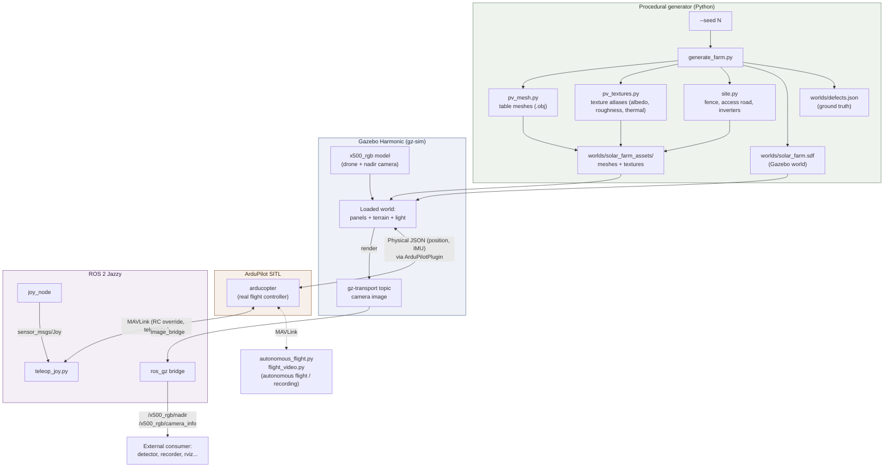
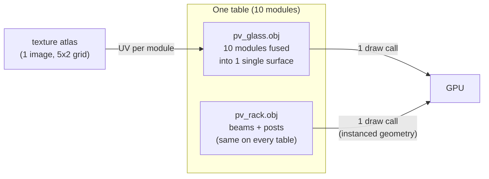
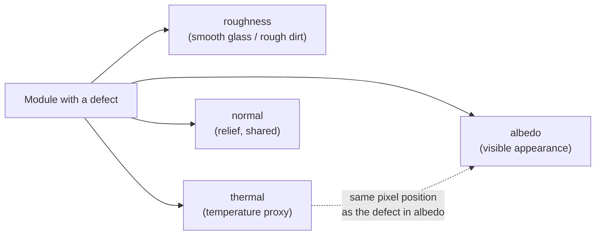
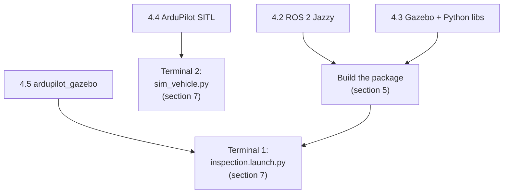
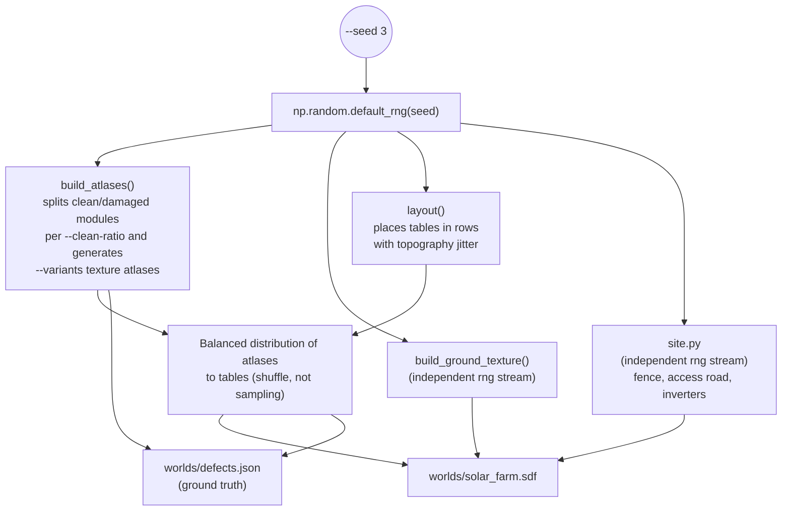
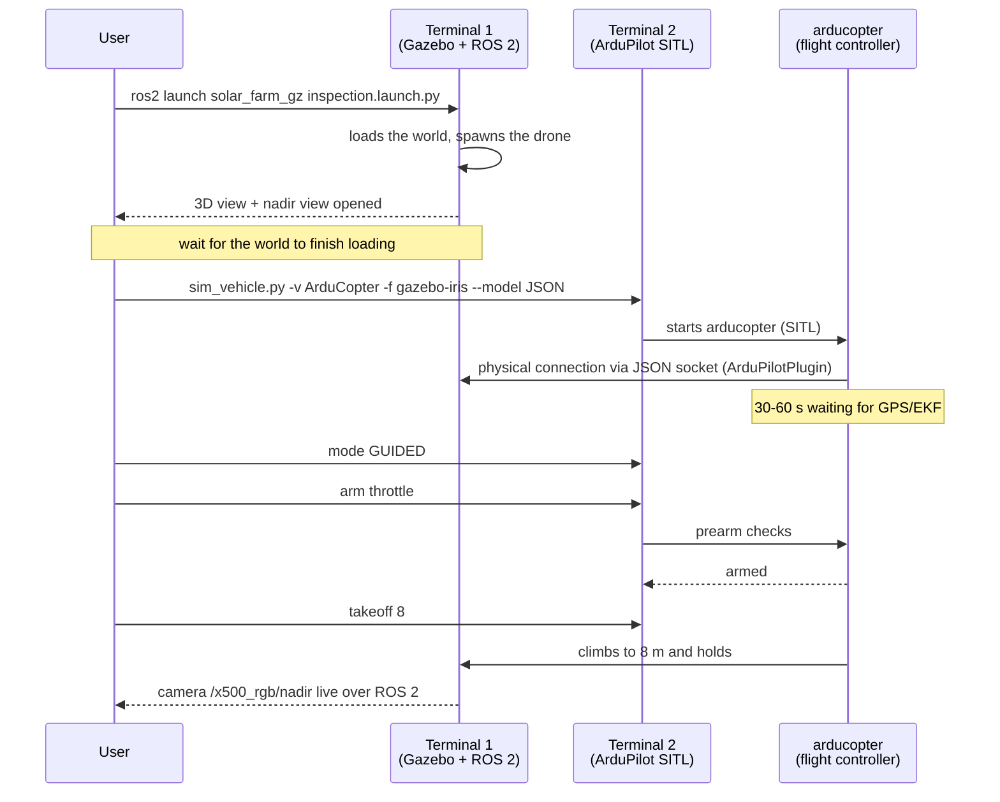
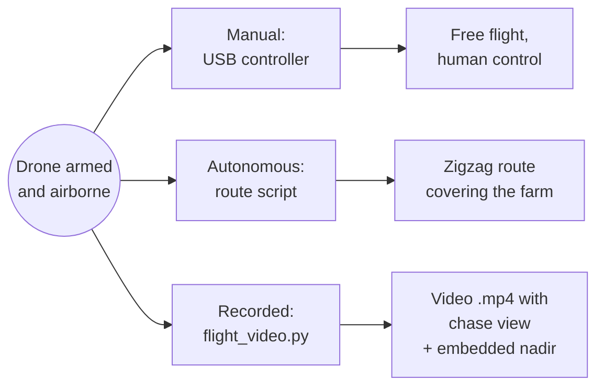
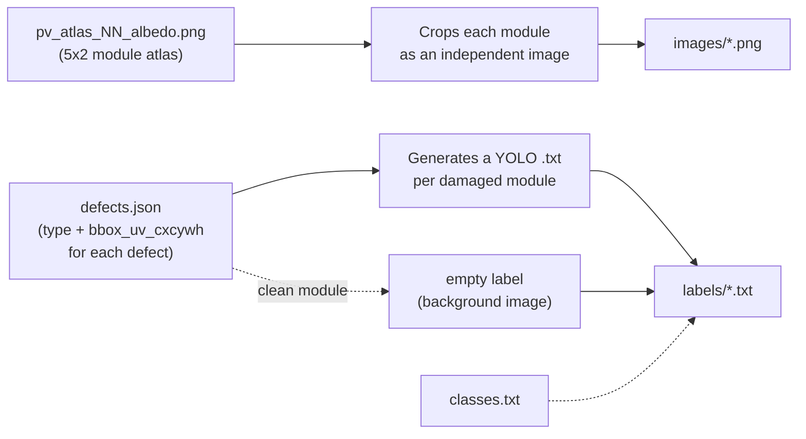

# Complete Manual — solar_farm_gz

*This document is a translation. The original is in [Spanish](MANUAL.md).*

The single reference guide for the project: what it is, how it is built, why
it is built that way, and how to install it, generate it, and fly it step by
step. This document gathers and expands on what the [README](../README-en.md), the
[Getting Started guide](GETTING_STARTED.md), the [operating
instructions](../INSTRUCTIONS-en.md), and the [roadmap](ROADMAP.md) (in Spanish) already
cover, but organized as a single manual with architecture and flow diagrams,
meant to be read start to finish the first time and used as a quick
reference afterward.

---

## Table of Contents

1. [What this project is](#1-what-this-project-is)
2. [Overall architecture](#2-overall-architecture)
3. [Methodology: why it's built this way](#3-methodology-why-its-built-this-way)
4. [Installing the prerequisites](#4-installing-the-prerequisites)
5. [Getting and building the project](#5-getting-and-building-the-project)
6. [Generating a world](#6-generating-a-world)
7. [Launching a flight — step-by-step tutorial](#7-launching-a-flight--step-by-step-tutorial)
8. [Flying: manual, autonomous, or recorded](#8-flying-manual-autonomous-or-recorded)
9. [Capturing images and videos without flying](#9-capturing-images-and-videos-without-flying)
10. [Building a training dataset](#10-building-a-training-dataset)
11. [Project file map](#11-project-file-map)
12. [Quick command reference](#12-quick-command-reference)
13. [Troubleshooting](#13-troubleshooting)
14. [What the project includes, and optional improvements](#14-what-the-project-includes-and-optional-improvements)
15. [Known limitations](#15-known-limitations)
16. [Glossary](#16-glossary)

---

## 1. What this project is

### Origin: why a simulation instead of a real drone

This project is an open source demonstration by **EuropeSIP Communications
S.L.**, a company specializing in Digital Transformation, Portals, and
Artificial Intelligence, built to explore the possibilities of AI in image
recognition and vision-based decision-making applied to engineering (more
information in [EuropeSIP's AI
solutions](https://www.europesip.com/es/europesip/soluciones/inteligencia-artificial)).
The concrete goal: simulate the flight of an inspection drone over a
photovoltaic solar farm capable of detecting defects in the panels —
dirt, cracks, delamination, bird droppings — automatically and without
manual intervention, using **YOLO** and **OpenCV**.

The original plan was not this one. The initial idea was to do it with a
real drone: build it from scratch, mount the necessary sensors — including a
thermal camera, key for detecting hot spots on damaged cells — and fly over
real photovoltaic installations to capture and label defect images to train
a detector.

That plan quickly ran into several difficulties, any one of which alone
would have been enough to derail the project:

- **Equipment cost.** A thermal camera with enough resolution to detect
  hot spots on a damaged panel is not cheap, and it adds to the rest of the
  required gear: chassis, flight controller, RGB camera, video link,
  batteries, spare parts in case something breaks on a test flight... for a
  prototype, that budget stops being trivial very quickly.
- **Legal access to installations.** Flying a drone over a real
  photovoltaic plant while complying with current civil aviation regulations
  (permits, airspace restrictions, liability insurance) is neither a quick
  nor a simple procedure — and the vast majority of installations are
  private property, with their own access control.
- **Finding actually damaged panels.** Even after solving the two points
  above, you need an installation with real defects, varied and in
  sufficient quantity to train and evaluate a detector — and, naturally, no
  solar plant operator has broken or dirty panels sitting around waiting for
  someone to photograph them for a demo.

Faced with that scenario, the reasonable alternative became clear: if the
drone cannot be brought to a damaged solar farm, the solar farm — with its
defects, and on demand — can be brought to the drone, inside a simulated
world. That is why this project uses Gazebo and ROS 2 — tools that make it
possible to faithfully simulate the behavior of industrial robots and
drones —, and it does so not as a second-rate substitute for a real drone,
but as the path that makes it possible to prototype and complete the
project's goal without depending on equipment cost, flight bureaucracy, or
the availability of an already-damaged real installation:

- A procedurally generated solar farm has no access or ownership cost: it
  is generated with a single command, with as many defects, types, and
  severity levels as needed, and as many times as needed.
- There is no need to buy a real thermal camera to have a thermal channel:
  the generator already renders, alongside each defect, a temperature
  channel co-registered pixel-for-pixel with the visible damage, and
  `flight_video.py --thermal` uses it to simulate a real thermal camera (see
  [section
  3.4](#34-the-thermal-channel-how-the-thermal-camera-reuses-the-same-assets)),
  without rebuilding any assets.
- No flight authorization, insurance, or weather window is needed: Gazebo
  simulates the physics of the environment, and the one piloting the drone
  within that physics is **ArduPilot SITL**, the same flight software that
  would fly a real drone — so the observed flight behavior is representative
  of what the physical drone would show, not a camera animation.
- Reproducibility is total: every generated world carries its own exact
  reference (*ground truth*) for each defect, with no need for manual
  labeling, and it can be repeated with different seeds as many times as
  needed to build a robust, varied training dataset.

### What it is, technically

`solar_farm_gz` is a **procedural generator of photovoltaic solar farms**
for the **Gazebo Harmonic** simulator, integrated with **ROS 2 Jazzy** and
with a **real inspection drone piloted by ArduPilot**. It serves a single,
concrete purpose: to produce, automatically and repeatably, images of solar
panels with already-labeled defects, to train detection models (YOLO, for
example) without having to photograph or label anything by hand.

The central idea is simple: **the entire world — panel layout, terrain,
lighting, and every surface defect — is produced from a single random seed
(`--seed`)**. Changing the seed generates a different farm: different
defect types, in different positions, with different sizes and
orientations. Nothing is placed by hand, so a detector can be trained on as
many world variations as needed, without repeating manual work.

Flying over that generated world is a **simulated drone** (a Holybro X500
V2 quadcopter with a Raspberry Pi Camera Module 3 pointed at nadir), piloted
by a real flight stack (**ArduPilot SITL**), not by a camera animation.
That means what the drone's camera sees is exactly what a real drone doing
an inspection would see: the same kind of vibration, framing, and flyover
speed.

### What it's for, in practice

| Need | How the project covers it |
|---|---|
| Generate images of panels with defects, already labeled | `generate_farm.py` generates the world and writes `defects.json` with the class and bounding box of each defect |
| Train a defect detector (YOLO or another) | `tools/build_quicklook_dataset.py` (quick atlas crop) or `tools/capture_dataset/` (real, camera-based dataset) convert `defects.json` and the world into a YOLO dataset — see [section 10](#10-building-a-training-dataset) |
| Test how a detection pipeline behaves with real flight video | `inspection.launch.py` + ArduPilot SITL stream the drone's camera to ROS 2 live, the way the physical drone would |
| Produce demo images or videos without hardware or a powerful GPU | `capture.py` renders in headless mode (no graphical interface) directly to PNG or MP4 |
| Test inspection flight logic (transects, row coverage) | `autonomous_flight.py` / `autonomous_flight_grid.py` fly autonomous zigzag routes over the generated farm |

### Who it's for

Anyone who needs **training data for a solar panel defect detector** and
does not have a real, photographed, and labeled farm, or who wants to
complement real data with perfectly labeled, varied synthetic data. It also
serves as a test bed for inspection flight logic before trying it on a
physical drone.

---

## 2. Overall architecture

The project connects three worlds that normally live apart: **procedural 3D
content generation** (pure Python), the **physics simulation and rendering
engine** (Gazebo Harmonic), and a **real drone flight stack** (ArduPilot).
ROS 2 is the glue that connects the simulation to anything external — a
detection pipeline, a recording script, a game controller.



*The generator produces the world once, offline. Gazebo loads and renders
it; ArduPilot pilots the aircraft inside that physical world; ROS 2
connects both to the outside world (controllers, recorders, detectors).*

### The pieces, one by one

| Component | What it is | What it's for |
|---|---|---|
| **Gazebo Harmonic** (`gz-sim` 8) | Physics simulation and 3D rendering engine | Simulates the physics (gravity, collisions) and renders the scene, including the drone's camera |
| **ROS 2 Jazzy** | Robotics middleware (message passing, nodes) | Exposes the camera, the simulation clock, and telemetry as standard topics that any ROS tool can read |
| **`ros_gz`** | Bridge between Gazebo and ROS 2 | Translates Gazebo's internal messages (`gz.msgs.*`) into ROS 2 messages (`sensor_msgs/*`) and back |
| **ArduPilot SITL** | The real ArduCopter autopilot *firmware*, compiled to run on a PC instead of on a flight board | Pilots the simulated aircraft with the same logic (EKF, flight modes, prearm checks) as a physical drone |
| **`ardupilot_gazebo`** | Gazebo plugin that connects ArduPilot to the physical world | Carries position, IMU, and actuators between Gazebo and SITL over a JSON socket |
| **Generator (`solar_farm_gz` Python package)** | `generate_farm.py`, `pv_mesh.py`, `pv_textures.py`, `site.py` | Builds the world — geometry, textures, defects, infrastructure — from a seed |
| **`capture.py`** | Headless capture tool | Renders still images or flight videos without opening Gazebo's graphical interface |
| **`flight_video.py`** | Real flight recorder | Flies a transect with real ArduPilot and records a chase view with an embedded nadir camera |
| **`teleop_joy.py`** | Controller teleoperation | Translates `sensor_msgs/Joy` into MAVLink RC channels |
| **`autonomous_flight.py`** | Autonomous inspection flight | Reads the real tables from the `.sdf` and flies a zigzag that covers all of them |
| **`tools/build_quicklook_dataset.py`** | Quick dataset builder | Converts texture atlases + `defects.json` into a YOLO dataset, without a camera |
| **`tools/capture_dataset/`** | Real dataset builder | Renders shots from the drone's camera and projects the 3D→2D boxes |

---

## 3. Methodology: why it's built this way

This project is not a generic solar panel mockup: every design decision
responds to a concrete constraint. Understanding them helps you know which
parameters to tweak and which not to.

### 3.1 Rendering cost is dominated by draw calls, not polygons

The project's most important constraint. Building the world the obvious way
— one 3D object per module, with each defect as separate geometry —
produces about 1500 visual objects in a 1000-panel farm, and renders at
**0.12x real time** on integrated graphics: a 2-minute flight would take
16 minutes to simulate.

The solution: **each table is exactly two meshes**.



*Two meshes per table, not fifteen: defects live in the atlas texture,
never in the geometry, so it makes no difference whether a farm is 20% or
60% damaged — the rendering cost is identical.*

This is what makes it possible to keep **real time (1.0x factor)** even on
a laptop with no discrete GPU for the 200-panel world, and on the
1000-panel one with `--texture-scale 0.5` or `--no-shadows` (see the
[Performance table in the README](../README-en.md#performance)).

### 3.2 Reproducibility: one seed, one world, always the same

Everything random in the generator — table layout, each defect's type, its
size, its position, the terrain, even the site infrastructure — comes from
a single `np.random.default_rng(seed)`. Two runs with the same seed produce
exactly the same world, byte for byte.

This has an important practical consequence: the optional elements (ground
style, infrastructure) use **independent random-number streams** derived
from the same seed (for example, `np.random.default_rng([seed, 0x62726F])`
for the ground texture). So enabling or disabling `--infrastructure` or
changing `--ground-style` does not shift a single table in the farm — it
lets you generate the same farm in two variants (with or without
infrastructure, grass or dirt) and compare them as an exact pair.

### 3.3 Why textures use `model://` and not relative paths

An easy detail to overlook, but one that causes silent errors if ignored:
`gz-sim` resolves a **relative** `<uri>` for a mesh against the
`GZ_SIM_RESOURCE_PATH` variable, but relative paths inside `<albedo_map>`,
`<roughness_map>`, and `<normal_map>` (inside `<pbr>`) **do not** resolve
the same way — they are silently discarded, and the surface ends up
untextured **with no error at all in the log**. That is why every generated
asset lives inside a real Gazebo model package
(`worlds/solar_farm_assets/`) and is referenced with `model://...` URIs,
which do resolve consistently in both cases.

### 3.4 The thermal channel: how the thermal camera reuses the same assets

Every texture atlas is not generated with a single channel (the visible
color), but with **four, co-registered pixel-for-pixel**:



*A crack that scatters light in `albedo` also writes its heat signature in
`thermal`, at the same pixels. `flight_video.py --thermal` swaps the
albedo material for this channel in the recorded nadir feed and colors it
in false color (see `_thermal_swap` and `THERMAL_LOW`/`THERMAL_HIGH` in
`flight_video.py`) — a simple material swap on the existing assets, with no
rebuilding and no second real sensor to add. The outside chase view is not
affected; only the embedded nadir feed is.*

### 3.5 The drone is a real model, not a generic quadcopter

The aircraft (`models/x500_rgb/model.sdf`) is modeled on a specific
physical airframe — a Holybro X500 V2, 500 mm between motors, 1.30 kg —
with a Raspberry Pi Camera Module 3 whose field of view (66° horizontal,
40.1° vertical at 16:9) and focal length (`fx` = 1478.27 px) are the
sensor's real values, not an approximation. The goal is that the simulated
images are directly comparable with those from a physical drone equipped
the same way, without having to retune the detector when moving from one
to the other.

### 3.6 The flight is real, not a camera animation

When `flight_video.py` or `autonomous_flight.py` "fly" the drone, they are
not moving a camera along a preset trajectory: they are talking over
MAVLink to a real `arducopter` process (ArduPilot SITL) running its own
control loop, its own state-estimation EKF, and its own safety checks
before arming. If the controller wobbles or takes time to stabilize, the
recorded video shows it — that is a deliberate property, not an oversight:
it lets you validate the flight logic the same way you would on a real
drone.

---

## 4. Installing the prerequisites

This section is a step-by-step tutorial from a freshly installed Ubuntu
machine. It is done only once.

### 4.1 Requirements

- **Ubuntu 24.04 LTS**, native (not inside WSL: Gazebo's renderer needs
  direct GPU access, and WSL's graphics layer is slow and unreliable for
  this)
- **ROS 2 Jazzy**
- **Gazebo Harmonic** (`gz-sim` 8), SDF 1.10
- A **discrete GPU** is recommended for the 1000-panel world at full
  resolution, but the project also runs on integrated graphics (with the
  fallback options described in the [README's performance
  section](../README-en.md#performance))

If the machine has an NVIDIA GPU, check the driver before anything else:

```bash
nvidia-smi
```

If the command does not exist or the driver is old:

```bash
sudo ubuntu-drivers autoinstall
sudo reboot
```

### 4.2 Installing ROS 2 Jazzy

```bash
sudo apt update && sudo apt install -y software-properties-common curl
sudo add-apt-repository universe
sudo curl -sSL https://raw.githubusercontent.com/ros/rosdistro/master/ros.key \
  -o /usr/share/keyrings/ros-archive-keyring.gpg
echo "deb [arch=$(dpkg --print-architecture) signed-by=/usr/share/keyrings/ros-archive-keyring.gpg] http://packages.ros.org/ros2/ubuntu $(. /etc/os-release && echo $UBUNTU_CODENAME) main" | \
  sudo tee /etc/apt/sources.list.d/ros2.list > /dev/null
sudo apt update
sudo apt install -y ros-jazzy-desktop
```

### 4.3 Installing Gazebo Harmonic, the ROS bridge, and the Python libraries

```bash
sudo apt install -y \
    gz-harmonic ros-jazzy-ros-gz ros-jazzy-joy \
    python3-numpy python3-scipy python3-pil python3-opencv \
    python3-pymavlink python3-colcon-common-extensions \
    libgstreamer1.0-dev libgstreamer-plugins-base1.0-dev \
    cmake g++ git rapidjson-dev libopencv-dev
```

If `python3-pymavlink` is not available on your mirror:

```bash
pip install --user --break-system-packages pymavlink MAVProxy
```

> This is enough if you only want to **generate worlds and images**
> (sections 6 and 9): the generator and the capture tool only need NumPy,
> SciPy, Pillow, and Gazebo/ROS. To **fly** the drone with a real
> autopilot, you also need the two components below.

### 4.4 Installing ArduPilot SITL

ArduPilot is an external project, independent of this repository.

```bash
git clone --recursive https://github.com/ArduPilot/ardupilot ~/ardupilot
cd ~/ardupilot
./waf configure --board sitl
./waf copter
```

The clone downloads many submodules — it is the slowest step of the whole
installation. Check that it worked:

```bash
ls ~/ardupilot/build/sitl/bin/arducopter
```

### 4.5 Installing the Gazebo ↔ ArduPilot bridge

Also an external project: the plugin that carries physics and IMU data
between Gazebo and SITL.

```bash
git clone https://github.com/ArduPilot/ardupilot_gazebo ~/ardupilot_gazebo
cd ~/ardupilot_gazebo
mkdir -p build && cd build
cmake .. -DCMAKE_BUILD_TYPE=RelWithDebInfo
make -j$(nproc)
```

The `cmake` output must say **Compiling against Gazebo Harmonic**. Check
that it worked:

```bash
ls ~/ardupilot_gazebo/build/libArduPilotPlugin.so
```

This is the end of the part that is done only once. The diagram below
summarizes what each step installs and what it's used for afterward:



---

## 5. Getting and building the project

```bash
git clone <este-repo> solar_farm_sim
cd solar_farm_sim
source /opt/ros/jazzy/setup.bash
colcon build --symlink-install
source install/setup.bash
```

Add the last two lines to your `~/.bashrc` so you don't have to repeat them
in every new terminal:

```bash
echo 'source /opt/ros/jazzy/setup.bash' >> ~/.bashrc
echo 'source ~/solar_farm_sim/install/setup.bash' >> ~/.bashrc
```

`colcon build` does not compile any C++ in this package (it's pure
Python); what it does is install the `solar_farm_gz` package as a `ros2
run`/`ros2 launch` command and, through an environment *hook*, configure
the `GZ_SIM_RESOURCE_PATH` variable to point at the installed `worlds/`
directory. That's why you need to rebuild (or at least re-`source
install/setup.bash`) every time you generate a new world: it's how Gazebo
learns those files exist.

> **A freshly cloned repo contains no world at all.** The `worlds/`
> directory is generated, not checked into git. The next step creates it.

---

## 6. Generating a world

From a seed, the generator builds everything Gazebo needs: meshes, texture
atlases, the SDF world file, and the `defects.json` with the reference for
every defect.



*The same `--seed` always reproduces exactly the same world. The random
streams for the ground and the infrastructure are independent of the main
one, so turning them on or off does not shift a single table.*

### Basic command

```bash
# the 200-panel demo world
ros2 run solar_farm_gz generate_farm -- \
    --panels 200 --tables-per-row 5 --variants 20 --seed 3 \
    -o src/solar_farm_gz/worlds

colcon build --symlink-install     # picks up the generated assets
```

It can also be run without ROS, since the generator only depends on NumPy,
SciPy, and Pillow:

```bash
cd src/solar_farm_gz
python3 -m solar_farm_gz.generate_farm --panels 200 --seed 3 -o worlds
```

### Most commonly used parameters

| Group | Flag | Default | What it controls |
|---|---|---|---|
| Farm | `--panels` | 1000 | total modules, rounded up to full tables |
| Farm | `--tables-per-row` | 10 | tables per east-west row |
| Farm | `--row-pitch` | 6.5 | meters between row centerlines |
| Defects | `--clean-ratio` | 0.80 | fraction of modules with no defects |
| Defects | `--variants` | 20 | distinct atlases in the set (more = less visual repetition) |
| Defects | `--w-dirt`, `--w-bird-dropping`, `--w-delamination`, `--w-crack` | 0.45 / 0.25 / 0.18 / 0.12 | relative weight of each defect type |
| Environment | `--sun-elevation`, `--sun-azimuth` | 55.0 / 140.0 | sun position, in degrees |
| Environment | `--ground-style` | `grass` | ground cover: `grass` or `earth` |
| Environment | `--no-shadows` | disabled | disables shading (better performance) |
| Output | `--seed` | 0 | controls the layout **and** every defect |
| Output | `--texture-scale` | 1.0 | reduces the resolution of the atlases (`0.5` for machines with little VRAM) |
| Output | `-o`, `--out` | `worlds` | output directory |

The full list, including site infrastructure (`--infrastructure`,
`--fence-margin`, `--inverters`), is in the
[README](../README-en.md#generating-a-world).

### Generating dataset variations

Each seed is an independent farm; the proportion, mix, and placement of
defects are independent axes:

```bash
# more damage, different distribution
python3 -m solar_farm_gz.generate_farm --seed 7  --clean-ratio 0.60 -o worlds_a

# site dominated by dirt
python3 -m solar_farm_gz.generate_farm --seed 12 --w-dirt 0.8 --w-crack 0.05 -o worlds_b

# late-afternoon pass with low light
python3 -m solar_farm_gz.generate_farm --seed 21 --sun-elevation 18 -o worlds_c
```

---

## 7. Launching a flight — step-by-step tutorial

This is the complete sequence to go from "nothing is running" to "the drone
is in the air and streaming its camera to ROS 2." You need **two
terminals**, each with ROS sourced (`source install/setup.bash`).



*Two independent processes that synchronize over two separate channels:
Gazebo and ArduPilot talk physics over a JSON socket; the user talks to
ArduPilot over MAVLink through the MAVProxy console.*

### Step 1 — Terminal 1: simulator

```bash
cd ~/solar_farm_sim
source install/setup.bash
ros2 launch solar_farm_gz inspection.launch.py
```

This does, in order:

1. Sets `GZ_SIM_RESOURCE_PATH` so Gazebo can find the generated world's
   assets.
2. If it detects an NVIDIA GPU, enables the PRIME *offload* variables to
   force rendering on it (see `solar_farm_gz/gpu.py`).
3. Launches Gazebo with the given world (`world:=solar_farm` by default)
   and the dual-view interface configuration (`gui/inspection.config`): the
   free-orbit 3D view and the nadir camera view, **open at the same
   time**.
4. Spawns the `x500_rgb` drone at the given position
   (`drone_x`/`drone_y`/`drone_z`/`drone_yaw`, `-6 -6 0.13 0` by default).
5. Connects the camera and the simulation clock to ROS 2 via
   `image_bridge` and `parameter_bridge`.

Wait for the world to finish loading (about 18 seconds for the 1000-panel
world) before continuing.

Available arguments:

| Argument | Default | Meaning |
|---|---|---|
| `world` | `solar_farm` | base name of the world file inside `worlds/` |
| `headless` | `false` | server only, no graphical interface (faster) |
| `bridge` | `true` | connects the camera, `camera_info`, and `/clock` to ROS 2 |
| `drone_x` `drone_y` `drone_z` | `-6 -6 0.13` | drone spawn position |
| `drone_yaw` | `0.0` | spawn heading, in radians |
| `ardupilot_gazebo` | `~/ardupilot_gazebo` | path where you cloned the plugin |

### Step 2 — Terminal 2: flight controller

```bash
cd ~/ardupilot
Tools/autotest/sim_vehicle.py -v ArduCopter -f gazebo-iris --model JSON \
    --console --map
```

This command starts the `arducopter` binary built in section 4.4, connects
it to the Gazebo world over the JSON socket exposed by the
`ArduPilotPlugin`, and opens the interactive **MAVProxy** console plus a
map.

Give it 30 to 60 seconds for the simulated GPS and the EKF filter to
settle. In the MAVProxy console:

```
mode GUIDED
arm throttle
takeoff 8
```

The drone climbs to 8 meters and holds there (hover). To land:

```
mode LAND
```

From here on the drone is really flying inside the simulation, and its
camera is already available at `/x500_rgb/nadir` in ROS 2 — the rest of
this manual (sections 8-10) explains what to do with that flight.

---

## 8. Flying: manual, autonomous, or recorded

With the simulator and ArduPilot already running (section 7), there are
three ways to move the drone, depending on what you need.



### 8.1 Manual flight with a controller

Connect a USB controller. In a third terminal:

```bash
source /opt/ros/jazzy/setup.bash
ros2 run joy joy_node
```

And in a fourth:

```bash
cd ~/solar_farm_sim && source install/setup.bash
ros2 run solar_farm_gz teleop_joy
```

`teleop_joy.py` translates the controller's axes and buttons into MAVLink
RC channels, talking directly to SITL (without going through MAVROS, so as
not to add a large dependency for what ultimately amounts to four numbers
and a *heartbeat*). By default it follows the **Mode 2** layout: the left
stick controls throttle/yaw, the right stick pitch/roll.

| Control | Default axis/button | Function |
|---|---|---|
| Left stick Y / X | axes 1, 0 | throttle, yaw |
| Right stick Y / X | axes 4, 3 | pitch, roll |
| Buttons 0–3 | — | LOITER, ALT_HOLD, STABILIZE, RTL |
| Buttons 7 / 6 | — | arm, disarm |

Fly in **LOITER** or **ALT_HOLD** rather than STABILIZE: these are modes
that hold position and are much easier to fly for inspection work. If your
controller has a different axis numbering, customize it without touching
any code:

```bash
ros2 run solar_farm_gz teleop_joy --ros-args \
    -p axis_throttle:=1 -p deadzone:=0.08 -p master:=tcp:127.0.0.1:5760
```

### 8.2 Autonomous flight (zigzag inspection route)

`autonomous_flight.py` (at the project root) automates the whole cycle:
connects over MAVLink, switches to GUIDED mode, arms, takes off, **reads
the actual positions of every table directly from the generated world's
`.sdf`** (it does not assume a uniform grid), builds a zigzag route that
covers all of them, flies it point by point, and returns home (RTL) at the
end.

```bash
python3 autonomous_flight.py
```

It is useful for validating that the flight coverage spans the whole farm
with no gaps, and as a reference for how to generate inspection routes from
the world file itself. `autonomous_flight_grid.py` is a simpler variant
that assumes a regular grid of rows instead of reading the `.sdf`.

### 8.3 Recording a flight (chase view + embedded nadir)

```bash
ros2 run solar_farm_gz flight_video -- \
    --world install/solar_farm_gz/share/solar_farm_gz/worlds/solar_farm.sdf \
    --route --route-tolerance 1.0 \
    --duration 120 -o videos/inspection_flight.mp4 \
    --nadir-out videos/inspection_flight_nadir.mp4
```

Unlike the two previous options, this tool **starts its own Gazebo and its
own ArduPilot SITL** (which is why any running simulator must be closed
before using it). It spawns the drone directly in a temporary capture
world along with a chase camera attached to the `base_link` via a fixed
joint, flies a real transect at the inspection parameters (8 m, 1.5 m/s by
default), and records a video with the chase view full-screen, the nadir
feed embedded in a corner, and a telemetry overlay (altitude, speed, GSD,
covered swath).

**`--route` (recommended)** flies table by table by absolute GPS position,
reading the real tables from the world's `.sdf` — the same as
`autonomous_flight.py` (§8.2). Without `--route`, the drone crosses in a
straight line from `--spawn` with a fixed heading, which only sweeps the
rows if that heading matches that particular world's actual orientation,
which is not guaranteed (details in [docs/ROADMAP.md](ROADMAP.md)).

| Option | Default | Meaning |
|---|---|---|
| `--duration` | 40 | seconds recorded; with `--route`, if the route finishes earlier, the recording ends there |
| `--alt` | 8.0 | altitude, in meters |
| `--speed` | 1.5 | cruise speed, m/s (only without `--route`) |
| `--route` | disabled | flies table by table by absolute GPS position — see above |
| `--route-tolerance` | 1.0 | meters of X tolerance for grouping tables into the same row (only with `--route`) |
| `--spawn` | `3.25,-10,0.13` | starting position; without `--route`, it also sets the cruise heading |
| `--width` `--height` | 1280 × 720 | output resolution |
| `--thermal` | disabled | the embedded nadir feed shows the simulated thermal camera (false color) instead of RGB; the chase view does not change |
| `--nadir-out` | disabled | in addition to the composite video, writes the raw nadir feed (native resolution, no frame or HUD) from the same flight — the resolution the detector trains on, and the one to use for running inference |
| `--title-line1` `--title-line2` | see `.env` | overlay title text; if not passed, read from `.env` (`FLIGHT_TITLE_LINE1`/`2`) |
| `--status-label` | see `.env` | overlay status label (`FLIGHT_STATUS_LABEL` in `.env`) |
| `--env-file` | `.env` | `KEY=VALUE` file the above text is read from when not passed as a flag |
| `-o`, `--out` | `inspection_flight.mp4` | output video path |

Full examples (RGB, thermal, custom titles) are in
[RUNME.md](../RUNME-en.md), section 2.1 — includes the complete list of
`--route` options.

---

## 9. Capturing images and videos without flying

When a real flight is not needed (for example, for a cover image or a
smooth waypoint flythrough video), `capture.py` renders **without opening
Gazebo's graphical interface**: it injects a camera into the world, starts
the server in *headless* mode, and pulls the frames directly from the
`gz-transport` image topic. It is the practical way to produce images on a
machine with no discrete GPU.

```bash
# single image: --pose is "x y z roll pitch yaw"
ros2 run solar_farm_gz capture -- \
    --world install/solar_farm_gz/share/solar_farm_gz/worlds/solar_farm.sdf \
    --pose "42 8 15 0 0.36 3.0" -o array_front.png

# flythrough video along a waypoint route (not a real flight, it is a
# camera linearly interpolating between points, paced by arc length)
ros2 run solar_farm_gz capture -- \
    --world .../solar_farm.sdf --fly \
    --path "92,53,36,0,0.50,3.1416; 70,53,23,0,0.45,3.1416; \
            29,4,11,0,0.45,1.5708; 29,100,11,0,0.45,1.5708" \
    --frames 240 --fps 30 -o flythrough.mp4
```

The world is loaded **only once** and the camera is repositioned between
frames via the `set_pose` service, instead of relaunching the world for
every frame — on the 1000-panel world that is the difference between ~1
minute and ~30 minutes. After each move, `--settle` frames (2 by default)
are discarded before sampling, so a saved frame is never one rendered
before the camera finished moving.

---

## 10. Building a training dataset

The scripts that generate datasets live in `tools/`, outside the data
folders — so `yolo_dataset/` and `quicklook_dataset/` contain only images,
labels, and `data.yaml`, ready to upload to Colab, Roboflow, or wherever
needed, with no code attached. There are two paths:

- **`tools/build_quicklook_dataset.py`** (this section) — crops each
  module directly from the texture atlas, without going through any
  camera. Fast, useful as a first check, but it does not represent the
  drone's real perspective.
- **`tools/capture_dataset/capture_dataset.py`** — generates the dataset
  meant for the real detector: it renders shots from the drone's camera in
  realistic poses and projects the boxes in 3D. This is the one that
  produced `yolo_dataset/`. See [RUNME.md, section
  3](../RUNME-en.md#3-the-yolo-training-dataset-is-not-a-video) and
  [tools/README.md](../tools/README.md) for details.

This section covers the first one. `tools/build_quicklook_dataset.py`
converts the texture atlases and `defects.json` into a dataset in **YOLO
format** (images + `.txt` labels).



*Every module in the atlas becomes a training image. If it is damaged, a
YOLO label is generated with the class and box of each defect; if it is
clean, an empty label is generated — the model also needs to see examples
of healthy panels.*

```bash
# 1. Inspect the real structure of defects.json (once)
python3 tools/build_quicklook_dataset.py --inspect

# 2. Generate a few images with the boxes drawn, to visually check
#    that they land on the real defect
python3 tools/build_quicklook_dataset.py --verify

# 3. Generate the full dataset
python3 tools/build_quicklook_dataset.py
```

The output (in `quicklook_dataset/` by default) contains:

```
quicklook_dataset/
├── images/<atlas>_<modulo>.png
├── labels/<atlas>_<modulo>.txt   # class xc yc w h, normalized 0-1
└── classes.txt                   # one class per line, in ID order
```

Since the `bbox_uv_cxcywh` that the generator exports is already
normalized 0–1 relative to the module itself, in YOLO's native format, no
pixel coordinate conversion is needed: it's a direct copy.

---

## 11. Project file map

```
solar_farm_sim/
├── README.md                        complete project reference
├── RUNME.md                         quick guide: launching the simulation and generating videos
├── INSTRUCTIONS.md                  operating guide (start, fly, debug)
├── docs/
│   ├── MANUAL.md                    this document
│   ├── GETTING_STARTED.md           beginner's guide
│   ├── YOLO_DATASET.md              full detail on the yolo_dataset/ dataset
│   └── ROADMAP.md                   optional improvements and pending notes
├── videos/                          generated videos (RGB and thermal, demos and footage)
├── tools/
│   ├── README.md                    what each script does and how to run it
│   ├── build_quicklook_dataset.py   atlases + defects.json -> quick YOLO dataset, no camera
│   └── capture_dataset/             generates the real dataset (with camera and 3D->2D projection)
├── yolo_dataset/                    real dataset: data only (images/, labels/, data.yaml)
├── quicklook_dataset/               quick dataset: data only (images/, labels/, classes.txt)
├── autonomous_flight.py              autonomous flight (reads tables from the .sdf)
├── autonomous_flight_grid.py         autonomous flight (assumed grid)
└── src/solar_farm_gz/
    ├── launch/
    │   ├── inspection.launch.py     world + drone + both views + ROS bridge
    │   └── solar_farm.launch.py     world only, no drone
    ├── models/x500_rgb/             the aircraft (chassis, camera, sensors)
    ├── gui/inspection.config        Gazebo's dual-view layout
    ├── worlds/                      generated world, assets, defects.json (not versioned)
    └── solar_farm_gz/
        ├── generate_farm.py         orchestrates the full world generation
        ├── pv_mesh.py                table geometry (2 meshes per table)
        ├── pv_textures.py            procedural texture and defect synthesis
        ├── site.py                   fence, access road, inverters
        ├── gpu.py                    NVIDIA GPU detection and offload
        ├── capture.py                headless capture (still image / flythrough)
        ├── flight_video.py           real flight recording with chase view
        └── teleop_joy.py             controller teleoperation over MAVLink
```

---

## 12. Quick command reference

| I want to... | Command |
|---|---|
| Generate a new world | `ros2 run solar_farm_gz generate_farm -- --panels 1000 --seed N -o src/solar_farm_gz/worlds` |
| Rebuild after generating | `colcon build --symlink-install && source install/setup.bash` |
| Launch the world without a drone | `ros2 launch solar_farm_gz solar_farm.launch.py` |
| Launch the world with a drone | `ros2 launch solar_farm_gz inspection.launch.py` |
| Start the autopilot | `cd ~/ardupilot && Tools/autotest/sim_vehicle.py -v ArduCopter -f gazebo-iris --model JSON --console --map` |
| Arm and take off (MAVProxy console) | `mode GUIDED` → `arm throttle` → `takeoff 8` |
| Fly with a controller | `ros2 run joy joy_node` + `ros2 run solar_farm_gz teleop_joy` |
| Fly an automatic route | `python3 autonomous_flight.py` |
| Record a real flight video (RGB) | `ros2 run solar_farm_gz flight_video -- --world <ruta.sdf> -o video.mp4` |
| Record a video with the simulated thermal camera | `ros2 run solar_farm_gz flight_video -- --world <ruta.sdf> --thermal -o video_thermal.mp4` |
| Capture an image without opening Gazebo | `ros2 run solar_farm_gz capture -- --world <ruta.sdf> --pose "x y z r p y" -o foto.png` |
| Build the quick YOLO dataset (no camera) | `python3 tools/build_quicklook_dataset.py` |
| Build the real YOLO dataset (with camera) | `python3 tools/capture_dataset/capture_dataset.py --world-dir <dir> --site <tag> --n 40 --seed N --images-out <dir> --labels-out <dir>` |
| Watch the drone's camera live | `ros2 run rqt_image_view rqt_image_view /x500_rgb/nadir` |

---

## 13. Troubleshooting

| Symptom | Likely cause / solution |
|---|---|
| `ros2: command not found` | `source /opt/ros/jazzy/setup.bash` is missing in that terminal |
| `Package 'solar_farm_gz' not found` | `source install/setup.bash` is missing, or the package has not been built yet |
| The world is empty on launch | There is no `.sdf` in `src/solar_farm_gz/worlds/` — generate one (section 6) |
| Flat gray panels, no texture | The world was not rebuilt after generating it — run `colcon build --symlink-install` again and re-source |
| Gazebo is slow / black window | It's probably rendering on integrated graphics instead of the discrete GPU — check with `nvidia-smi` while Gazebo is running; force NVIDIA with `__NV_PRIME_RENDER_OFFLOAD=1 __GLX_VENDOR_LIBRARY_NAME=nvidia` if needed |
| The drone won't arm (`Need Position Estimate`) | Wait another 30–60 s for GPS and the EKF to settle |
| `Check frame class and type` when arming | Use `sim_vehicle.py -f gazebo-iris` — it loads the correct frame parameters |
| `Gyro 0 rate ... < loop rate*1.8` | The world's `<max_step_size>` must be `0.001`; don't change it by hand if you edit the `.sdf` |
| The controller doesn't respond | Check `ros2 topic echo /joy`; if there's no output, the problem is the controller or the `joy` driver, not `teleop_joy` |
| `Connection refused` with two MAVLink tools at once | Port 5760 only accepts one client; point the second tool at `tcp:127.0.0.1:5762` |
| The `ardupilot_gazebo` bridge doesn't build | Missing `libgstreamer1.0-dev`/`libgstreamer-plugins-base1.0-dev`, or ROS wasn't sourced before `cmake` |
| The camera runs at ~23 fps instead of 30 | Expected: the bottleneck is image readback outside the renderer, not the rendering itself. It does not affect flight or the dataset (which is sampled at ~1 Hz regardless) |

More detail in section 10 of [INSTRUCTIONS.md](../INSTRUCTIONS-en.md).

---

## 14. What the project includes, and optional improvements

The project ships complete, as a single piece: procedural environment,
defect synthesis, ground truth (`defects.json`), real flight under
ArduPilot SITL, a drone modeled on a real airframe, controller
teleoperation, live camera streaming over ROS 2, site infrastructure,
autonomous transect recording, and a simulated thermal camera
(`flight_video.py --thermal`, [section
3.4](#34-the-thermal-channel-how-the-thermal-camera-reuses-the-same-assets)).

Beyond that, with no plan other than "whenever it's needed," there are
optional visual-realism improvements — more infrastructure, terrain relief,
higher-resolution PBR textures, a volumetric sky — that are production
value for presentations, not functional fixes. The full detail is in
[ROADMAP.md](ROADMAP.md).

---

## 15. Known limitations

- **Full-resolution performance with 1000 panels is provisional.** The
  world generates, loads, and renders correctly, and both fallback
  configurations (`--texture-scale 0.5` or `--no-shadows`) maintain real
  time, but the steady-state figure at full resolution on integrated
  graphics has not been independently reproduced. On a discrete GPU
  (confirmed on an RTX 5070) the full-resolution world holds real time
  with no need for those fallbacks.
- **Flat terrain.** The ground is a textured plane; there is no
  heightfield. This is faithful to the real domain (industrial solar
  farms sit on leveled ground), but there is no relief.
- **Cracks use a recursive random walk** and need
  `sys.setrecursionlimit` raised when generating very large worlds in a
  single process.
- **No modeled cabling or substation.** The site includes a fence, an
  access road, and inverters, but no cabling or a full substation.
- The drone's camera delivers ~23 Hz live instead of the configured
  30 Hz (limited by image readback, not by the GPU); recording below real
  time recovers the full rate when needed.

---

## 16. Glossary

| Term | Meaning |
|---|---|
| **SDF** | *Simulation Description Format*: the XML format Gazebo uses to describe a world, a model, or a sensor |
| **`gz-sim`** | The Gazebo Harmonic simulator itself (physics engine + renderer) |
| **SITL** | *Software In The Loop*: real flight firmware (ArduPilot) compiled to run on a PC instead of on a physical flight board |
| **MAVLink** | Binary messaging protocol between an autopilot and a ground station or a companion computer |
| **EKF** | *Extended Kalman Filter*: the filter ArduPilot uses to fuse GPS, IMU, and other sensors and estimate the aircraft's true position |
| **GUIDED / LOITER / ALT_HOLD / STABILIZE / RTL** | ArduCopter flight modes: command-based navigation, hold position, hold altitude, manual stabilization, and *Return To Launch* (return home) |
| **Atlas (texture)** | A single image that packs several smaller textures (here, the 10 modules of a table) into a grid, to reduce the number of *draw calls* |
| **`model://`** | Gazebo's URI scheme for referencing assets inside a model package, resolved consistently for both meshes and material maps |
| **GSD** | *Ground Sample Distance*: how many millimeters of the real world a camera pixel represents at a given altitude |
| **`ros_gz`** | The official bridge between Gazebo's internal messages (`gz.msgs.*`) and ROS 2 messages (`sensor_msgs/*`, etc.) |
| **Ground truth** | The reference truth: in this project, `defects.json`, generated alongside each defect instead of annotated by hand |
| **YOLO (format)** | Object detection label format: one line per object, `class xc yc w h`, all normalized 0–1 relative to the image |
