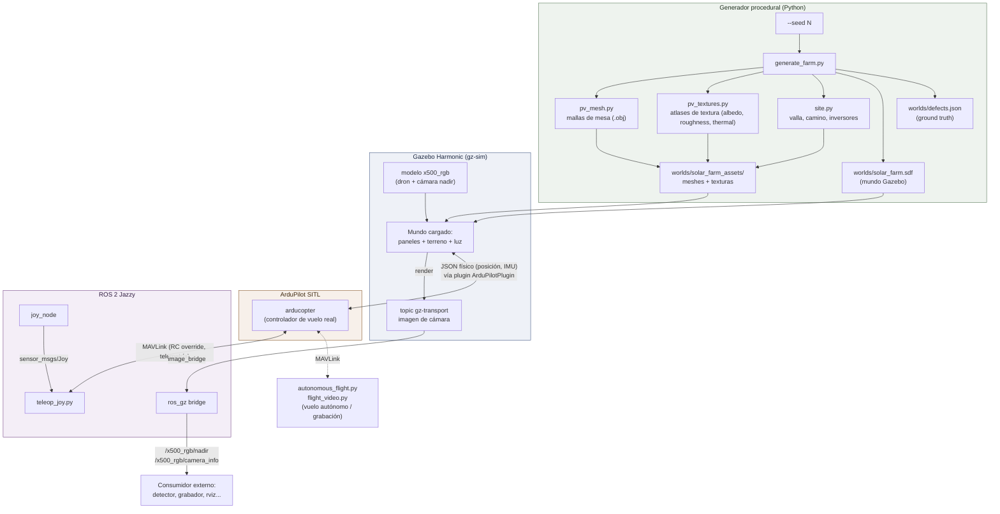
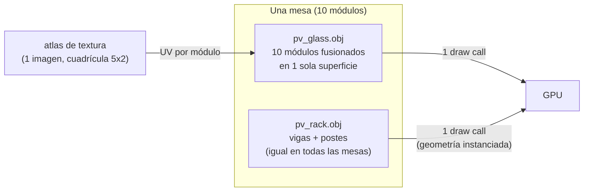
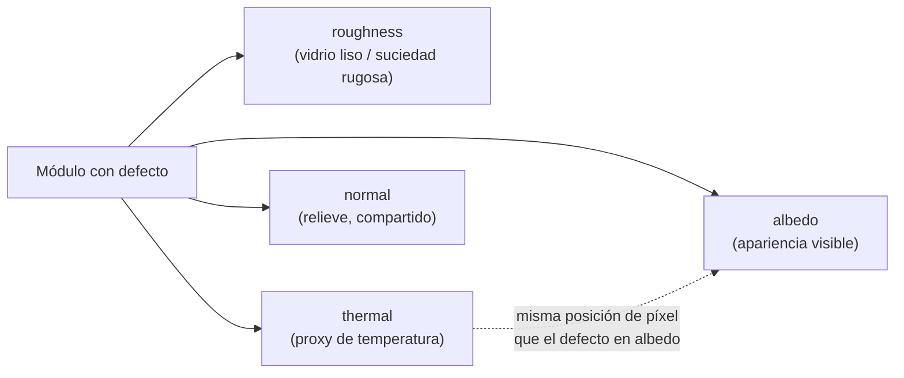
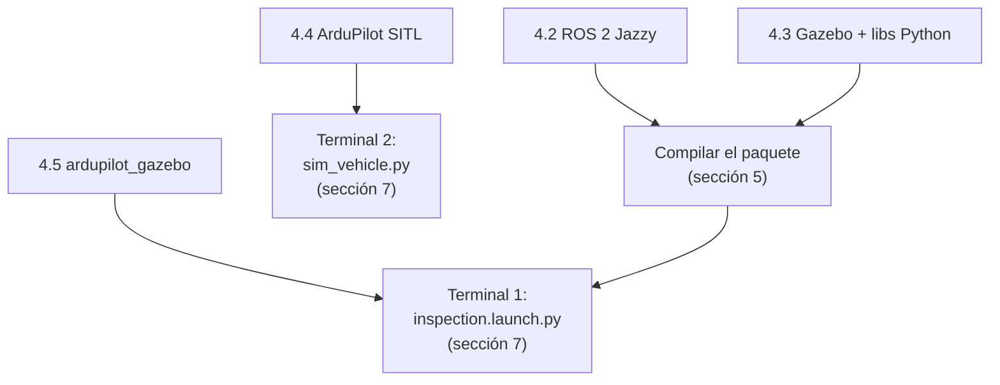
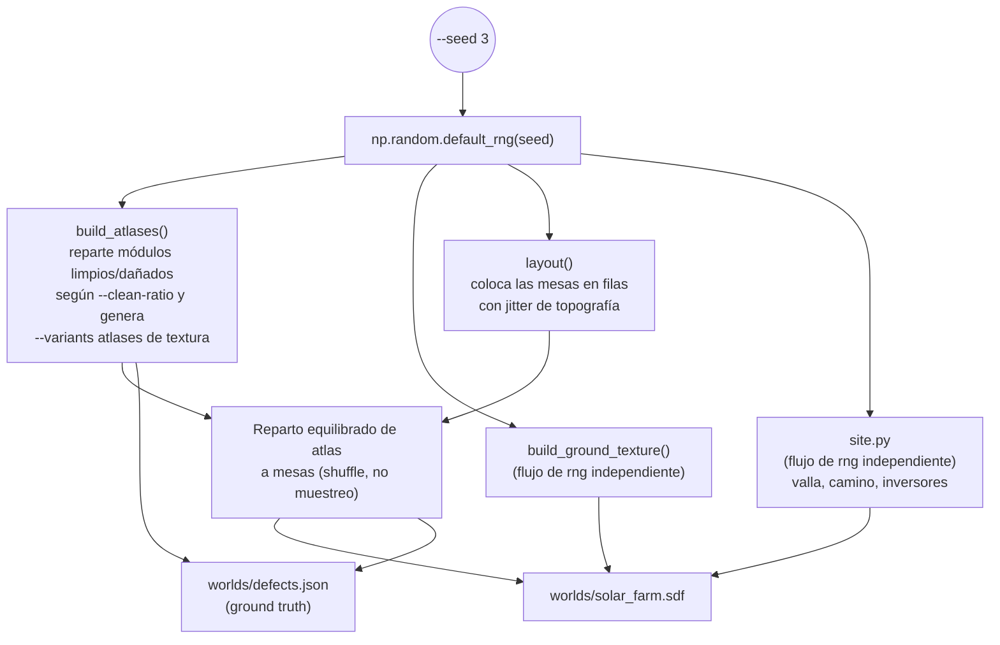
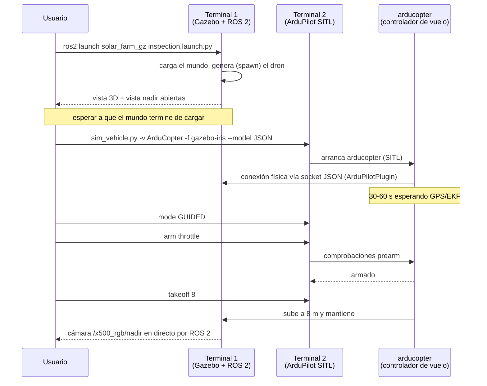
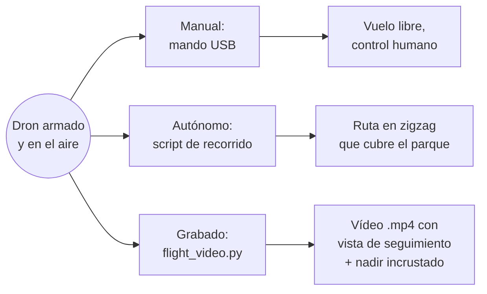
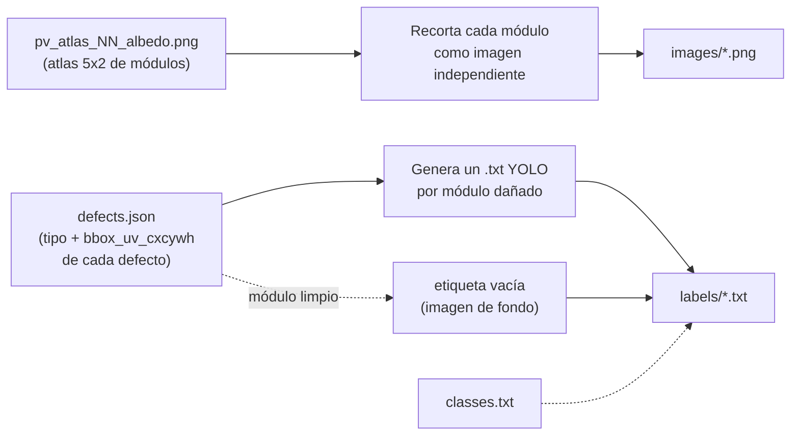

# Manual completo — solar_farm_gz

*This document is also available in [English](MANUAL-en.md).*

Guía de referencia única del proyecto: qué es, cómo está construido, por qué
está construido así, y cómo instalarlo, generarlo y volarlo paso a paso.
Este documento reúne y amplía lo que ya cuentan el [README](../README.md), la
[guía de inicio](GETTING_STARTED.md), las [instrucciones de
ejecución](../INSTRUCTIONS.md) y la [hoja de ruta](ROADMAP.md), pero
organizado como un único manual con diagramas de la arquitectura y de los
flujos, pensado para leerse de principio a fin la primera vez y usarse como
referencia rápida después.

---

## Índice

1. [Qué es este proyecto](#1-qué-es-este-proyecto)
2. [Arquitectura general](#2-arquitectura-general)
3. [Metodología: por qué está construido así](#3-metodología-por-qué-está-construido-así)
4. [Instalación de los prerrequisitos](#4-instalación-de-los-prerrequisitos)
5. [Obtener y compilar el proyecto](#5-obtener-y-compilar-el-proyecto)
6. [Generar un mundo](#6-generar-un-mundo)
7. [Lanzar el vuelo — tutorial paso a paso](#7-lanzar-el-vuelo--tutorial-paso-a-paso)
8. [Volar: manual, autónomo o grabado](#8-volar-manual-autónomo-o-grabado)
9. [Capturar imágenes y vídeos sin volar](#9-capturar-imágenes-y-vídeos-sin-volar)
10. [Construir un dataset de entrenamiento](#10-construir-un-dataset-de-entrenamiento)
11. [Mapa de ficheros del proyecto](#11-mapa-de-ficheros-del-proyecto)
12. [Referencia rápida de comandos](#12-referencia-rápida-de-comandos)
13. [Solución de problemas](#13-solución-de-problemas)
14. [Qué incluye el proyecto y mejoras opcionales](#14-qué-incluye-el-proyecto-y-mejoras-opcionales)
15. [Límites conocidos](#15-límites-conocidos)
16. [Glosario](#16-glosario)

---

## 1. Qué es este proyecto

### Origen: por qué existe una simulación en vez de un dron real

Este proyecto es una demostración open source de **EuropeSIP
Communications S.L.**, empresa especializada en Transformación Digital,
Portales e Inteligencia Artificial, para explorar las posibilidades de la
IA en el reconocimiento de imagen y las decisiones basadas en visión
aplicadas a la ingeniería (más información en las [soluciones de IA de
EuropeSIP](https://www.europesip.com/es/europesip/soluciones/inteligencia-artificial)).
El objetivo concreto: simular el vuelo de un dron de inspección sobre un
parque solar fotovoltaico capaz de detectar defectos en los paneles —
suciedad, grietas, delaminación, excrementos de aves — de forma
automática y sin intervención manual, usando **YOLO** y **OpenCV**.

El plan original no era este. La idea inicial era hacerlo con un dron
real: construirlo desde cero, montar los sensores necesarios — incluida una
cámara termográfica, clave para detectar puntos calientes en celdas
dañadas — y volar sobre instalaciones fotovoltaicas reales para capturar y
etiquetar imágenes de defectos con las que entrenar un detector.

Ese plan se topó pronto con varias dificultades, cada una suficiente por sí
sola para hacer descarrilar el proyecto:

- **El coste del equipo.** Una cámara termográfica con resolución
  suficiente para detectar puntos calientes en un panel dañado no es
  barata, y se suma al resto del material necesario: chasis, controlador
  de vuelo, cámara RGB, enlace de vídeo, baterías, repuestos por si algo se
  rompe en un vuelo de pruebas... para un prototipo, ese presupuesto deja
  de ser trivial muy rápido.
- **El acceso legal a instalaciones.** Volar un dron sobre una planta
  fotovoltaica real, cumpliendo la normativa de aviación civil vigente
  (autorizaciones, restricciones de espacio aéreo, seguros de
  responsabilidad civil), no es un trámite rápido ni sencillo — y la
  inmensa mayoría de instalaciones son propiedad privada, con su propio
  control de acceso.
- **Encontrar paneles realmente dañados.** Incluso resolviendo los dos
  puntos anteriores, hace falta una instalación con defectos reales,
  variados y en cantidad suficiente para poder entrenar y evaluar un
  detector — y, lógicamente, ningún operador de una planta solar tiene
  paneles rotos o sucios esperando a que alguien los fotografíe para una
  demostración.

Ante ese escenario, la alternativa razonable quedó clara: si no se puede
llevar el dron hasta un parque solar dañado, se puede llevar el parque
solar — con sus defectos, y a demanda — hasta el dron, dentro de un mundo
simulado. Por eso este proyecto usa Gazebo y ROS 2 — herramientas que
permiten simular con fidelidad el comportamiento de robots industriales y
drones —, y no lo hace como sustituto de segunda categoría del dron real,
sino como la vía que permite prototipar y completar el objetivo del
proyecto sin depender del coste del equipo, de la burocracia de vuelo ni
de la disponibilidad de una instalación real ya dañada:

- Un parque solar generado proceduralmente no tiene coste de acceso ni de
  propietario: se genera con un único comando, con tantos defectos, tipos y
  niveles de severidad como haga falta, y tantas veces como haga falta.
- No hace falta comprar una cámara termográfica real para disponer de un
  canal térmico: el generador ya renderiza, junto a cada defecto, un canal
  de temperatura co-registrado píxel a píxel con el daño visible, y
  `flight_video.py --thermal` lo usa para simular una cámara térmica real
  (ver [sección
  3.4](#34-el-canal-térmico-cómo-la-cámara-térmica-reutiliza-los-mismos-recursos)),
  sin rehacer ningún recurso.
- No hace falta autorización de vuelo, seguro ni ventana meteorológica:
  Gazebo simula la física del entorno, y quien pilota el dron dentro de esa
  física es **ArduPilot SITL**, el mismo software de vuelo que llevaría un
  dron real — así que el comportamiento de vuelo observado es representativo
  del que tendría el dron físico, no una animación de cámara.
- La reproducibilidad es total: cada mundo generado trae su propia
  referencia (*ground truth*) exacta de cada defecto, sin necesidad de
  etiquetado manual, y se puede repetir con semillas distintas tantas veces
  como haga falta para construir un dataset de entrenamiento robusto y
  variado.

### Qué es, técnicamente

`solar_farm_gz` es un **generador procedural de parques solares
fotovoltaicos** para el simulador **Gazebo Harmonic**, integrado con **ROS 2
Jazzy** y con un **dron de inspección real pilotado por ArduPilot**. Sirve
para un único propósito concreto: producir, de forma automática y repetible,
imágenes de paneles solares con defectos ya etiquetados, para entrenar
modelos de detección (por ejemplo, YOLO) sin tener que fotografiar ni
etiquetar nada a mano.

La idea central es sencilla: **todo el mundo — la disposición de los
paneles, el terreno, la iluminación y cada defecto de superficie — se
produce a partir de una única semilla aleatoria (`--seed`)**. Cambiar la
semilla genera un parque distinto: otros tipos de defecto, en otras
posiciones, con otros tamaños y orientaciones. Nada se coloca a mano, así
que se puede entrenar un detector con tantas variaciones del mundo como
haga falta, sin repetir trabajo manual.

Sobre ese mundo generado vuela un **dron simulado** (un cuadricóptero
Holybro X500 V2 con una cámara Raspberry Pi Camera Module 3 en nadir),
pilotado por una pila de vuelo real (**ArduPilot SITL**), no por una
animación de cámara. Eso significa que lo que se ve en la cámara del dron es
exactamente lo que vería un dron real haciendo una inspección: el mismo
tipo de vibración, encuadre y velocidad de sobrevuelo.

### Para qué sirve, en la práctica

| Necesidad | Cómo la cubre el proyecto |
|---|---|
| Generar imágenes de paneles con defectos, ya etiquetadas | `generate_farm.py` genera el mundo y escribe `defects.json` con la clase y la caja delimitadora de cada defecto |
| Entrenar un detector de defectos (YOLO u otro) | `tools/build_quicklook_dataset.py` (recorte rápido del atlas) o `tools/capture_dataset/` (dataset real, con cámara) convierten `defects.json` y el mundo en un dataset YOLO — ver [sección 10](#10-construir-un-dataset-de-entrenamiento) |
| Probar cómo se comporta un pipeline de detección con vídeo real de vuelo | `inspection.launch.py` + ArduPilot SITL transmiten la cámara del dron a ROS 2 en directo, como lo haría el dron físico |
| Producir imágenes o vídeos de demostración sin hardware ni GPU potente | `capture.py` renderiza en modo headless (sin interfaz gráfica) directamente a PNG o MP4 |
| Ensayar la lógica de vuelo de inspección (transectos, cobertura de filas) | `autonomous_flight.py` / `autonomous_flight_grid.py` vuelan rutas autónomas en zigzag sobre el parque generado |

### A quién está dirigido

A quien necesite **datos de entrenamiento para un detector de defectos en
paneles solares** y no disponga de un parque real fotografiado y etiquetado,
o quiera complementar datos reales con datos sintéticos perfectamente
etiquetados y variados. También sirve como banco de pruebas para lógica de
vuelo de inspección antes de probarla en un dron físico.

---

## 2. Arquitectura general

El proyecto conecta tres mundos que normalmente viven por separado: la
**generación procedural de contenido 3D** (Python puro), el **motor de
simulación física y de render** (Gazebo Harmonic) y una **pila de vuelo de
dron real** (ArduPilot). ROS 2 es el pegamento que conecta la simulación con
cualquier cosa externa — un pipeline de detección, un script de grabación,
un mando de videojuegos.



*El generador produce el mundo una sola vez, fuera de línea. Gazebo lo
carga y lo renderiza; ArduPilot pilota la aeronave dentro de ese mundo
físico; ROS 2 conecta ambos con el exterior (mandos, grabadores,
detectores).*

### Las piezas, una por una

| Componente | Qué es | Para qué vale |
|---|---|---|
| **Gazebo Harmonic** (`gz-sim` 8) | Motor de simulación física y de render 3D | Simula la física (gravedad, colisiones) y renderiza la escena, incluida la cámara del dron |
| **ROS 2 Jazzy** | Middleware de robótica (paso de mensajes, nodos) | Expone la cámara, el reloj de simulación y la telemetría como topics estándar que cualquier herramienta ROS puede leer |
| **`ros_gz`** | Puente entre Gazebo y ROS 2 | Traduce mensajes internos de Gazebo (`gz.msgs.*`) a mensajes ROS 2 (`sensor_msgs/*`) y viceversa |
| **ArduPilot SITL** | El *firmware* real de un piloto automático ArduCopter, compilado para correr en el PC en vez de en una placa de vuelo | Pilota la aeronave simulada con la misma lógica (EKF, modos de vuelo, prearm checks) que un dron físico |
| **`ardupilot_gazebo`** | Plugin de Gazebo que conecta ArduPilot con el mundo físico | Transporta posición, IMU y actuadores entre Gazebo y SITL por un socket JSON |
| **Generador (`solar_farm_gz` paquete Python)** | `generate_farm.py`, `pv_mesh.py`, `pv_textures.py`, `site.py` | Construye el mundo — geometría, texturas, defectos, infraestructura — a partir de una semilla |
| **`capture.py`** | Herramienta de captura headless | Renderiza imágenes fijas o vídeos de vuelo sin abrir la interfaz gráfica de Gazebo |
| **`flight_video.py`** | Grabador de vuelo real | Vuela un transecto con ArduPilot de verdad y graba una vista de seguimiento con la cámara de nadir incrustada |
| **`teleop_joy.py`** | Teleoperación con mando | Traduce `sensor_msgs/Joy` a canales RC de MAVLink |
| **`autonomous_flight.py`** | Vuelo autónomo de inspección | Lee las mesas reales del `.sdf` y vuela un zigzag que las cubre todas |
| **`tools/build_quicklook_dataset.py`** | Constructor de dataset rápido | Convierte los atlases de textura + `defects.json` en un dataset YOLO, sin cámara |
| **`tools/capture_dataset/`** | Constructor de dataset real | Renderiza tomas desde la cámara del dron y proyecta las cajas 3D→2D |

---

## 3. Metodología: por qué está construido así

Este proyecto no es una maqueta genérica de paneles solares: cada decisión
de diseño responde a una restricción concreta. Entenderlas ayuda a saber
qué parámetros tocar y cuáles no.

### 3.1 El coste de renderizado lo dominan las *draw calls*, no los polígonos

La restricción más importante del proyecto. Construir el mundo de la forma
obvia — un objeto 3D por módulo, con cada defecto como geometría aparte —
produce en un parque de 1000 paneles unos 1500 objetos visuales, y renderiza
a **0.12x tiempo real** en gráficos integrados: un vuelo de 2 minutos
tardaría 16 minutos en simularse.

La solución: **cada mesa es exactamente dos mallas**.



*Dos mallas por mesa, no quince: los defectos viven en la textura del
atlas, nunca en la geometría, así que da igual si un parque está dañado al
20% o al 60% — el coste de renderizado es idéntico.*

Esto es lo que hace posible mantener **tiempo real (factor 1.0)** incluso
en un portátil sin GPU discreta para el mundo de 200 paneles, y en el de
1000 paneles con `--texture-scale 0.5` o `--no-shadows` (ver la tabla de
[Rendimiento en el README](../README.md#rendimiento)).

### 3.2 Reproducibilidad: una semilla, un mundo, siempre igual

Todo lo aleatorio del generador — disposición de mesas, tipo de cada
defecto, su tamaño, su posición, el terreno, incluso la infraestructura del
emplazamiento — sale de un único `np.random.default_rng(seed)`. Dos
ejecuciones con la misma semilla producen exactamente el mismo mundo, byte
a byte.

Esto tiene una consecuencia práctica importante: los elementos opcionales
(estilo de suelo, infraestructura) usan **flujos de números aleatorios
independientes** derivados de la misma semilla (por ejemplo,
`np.random.default_rng([seed, 0x62726F])` para la textura del suelo). Así,
activar o desactivar `--infrastructure` o cambiar `--ground-style` no
desplaza ni una sola mesa del parque — permite generar el mismo parque en
dos variantes (con o sin infraestructura, césped o tierra) y compararlas
como un par exacto.

### 3.3 Por qué las texturas usan `model://` y no rutas relativas

Un detalle fácil de pasar por alto pero que causa errores silenciosos si se
ignora: `gz-sim` resuelve un `<uri>` **relativo** para una malla contra la
variable `GZ_SIM_RESOURCE_PATH`, pero las rutas relativas dentro de
`<albedo_map>`, `<roughness_map>` y `<normal_map>` (dentro de `<pbr>`) **no**
se resuelven igual — se descartan en silencio, y la superficie se queda sin
textura **sin ningún error en el log**. Por eso todos los recursos
generados viven en un paquete de modelo real de Gazebo
(`worlds/solar_farm_assets/`) y se referencian con URIs `model://...`, que
sí se resuelven de forma consistente en ambos casos.

### 3.4 El canal térmico: cómo la cámara térmica reutiliza los mismos recursos

Cada atlas de textura no se genera con un solo canal (el color visible),
sino con **cuatro, co-registrados píxel a píxel**:



*Una grieta que dispersa luz en `albedo` también escribe su firma de calor
en `thermal`, en los mismos píxeles. `flight_video.py --thermal` cambia el
material de albedo por este canal en la señal de nadir grabada y lo
colorea en falso color (ver `_thermal_swap` y `THERMAL_LOW`/`THERMAL_HIGH`
en `flight_video.py`) — un simple cambio de material sobre los recursos
existentes, sin ninguna reconstrucción ni segundo sensor real que añadir.
La vista de seguimiento (chase) exterior no se ve afectada; solo la señal
de nadir incrustada.*

### 3.5 El dron es un modelo real, no un cuadricóptero genérico

La aeronave (`models/x500_rgb/model.sdf`) está modelada sobre un armazón
físico concreto — un Holybro X500 V2 de 500 mm entre motores, 1.30 kg — con
una cámara Raspberry Pi Camera Module 3 cuyo campo de visión (66°
horizontal, 40.1° vertical a 16:9) y distancia focal (`fx` = 1478.27 px) son
los reales del sensor, no una aproximación. El objetivo es que las
imágenes simuladas sean directamente comparables con las de un dron físico
equipado igual, sin tener que reajustar el detector al pasar de una a otra.

### 3.6 El vuelo es real, no una animación de cámara

Cuando `flight_video.py` o `autonomous_flight.py` "vuelan" el dron, no están
moviendo una cámara por una trayectoria prefijada: están hablando por
MAVLink con un proceso real de `arducopter` (ArduPilot SITL) que ejecuta su
propio bucle de control, su propio EKF de estimación de estado y sus
propias comprobaciones de seguridad antes de armar. Si el controlador se
tambalea o tarda en estabilizarse, el vídeo grabado lo muestra — es una
propiedad deliberada, no un descuido: sirve para validar la lógica de vuelo
igual que se validaría en un dron real.

---

## 4. Instalación de los prerrequisitos

Esta sección es un tutorial paso a paso desde una máquina Ubuntu recién
instalada. Solo se hace una vez.

### 4.1 Requisitos

- **Ubuntu 24.04 LTS**, nativo (no dentro de WSL: el renderizador de Gazebo
  necesita acceso directo a la GPU, y la capa gráfica de WSL es lenta y
  poco fiable para esto)
- **ROS 2 Jazzy**
- **Gazebo Harmonic** (`gz-sim` 8), SDF 1.10
- Se recomienda una **GPU discreta** para el mundo de 1000 paneles a
  resolución completa, pero el proyecto también corre en gráficos
  integrados (con las alternativas descritas en la sección de
  [rendimiento del README](../README.md#rendimiento))

Si el equipo tiene una GPU NVIDIA, comprueba el driver antes de nada:

```bash
nvidia-smi
```

Si el comando no existe o el driver es antiguo:

```bash
sudo ubuntu-drivers autoinstall
sudo reboot
```

### 4.2 Instalar ROS 2 Jazzy

```bash
sudo apt update && sudo apt install -y software-properties-common curl
sudo add-apt-repository universe
sudo curl -sSL https://raw.githubusercontent.com/ros/rosdistro/master/ros.key \
  -o /usr/share/keyrings/ros-archive-keyring.gpg
echo "deb [arch=$(dpkg --print-architecture) signed-by=/usr/share/keyrings/ros-archive-keyring.gpg] http://packages.ros.org/ros2/ubuntu $(. /etc/os-release && echo $UBUNTU_CODENAME) main" | \
  sudo tee /etc/apt/sources.list.d/ros2.list > /dev/null
sudo apt update
sudo apt install -y ros-jazzy-desktop
```

### 4.3 Instalar Gazebo Harmonic, el puente ROS y las librerías Python

```bash
sudo apt install -y \
    gz-harmonic ros-jazzy-ros-gz ros-jazzy-joy \
    python3-numpy python3-scipy python3-pil python3-opencv \
    python3-pymavlink python3-colcon-common-extensions \
    libgstreamer1.0-dev libgstreamer-plugins-base1.0-dev \
    cmake g++ git rapidjson-dev libopencv-dev
```

Si `python3-pymavlink` no está disponible en tu mirror:

```bash
pip install --user --break-system-packages pymavlink MAVProxy
```

> Con esto basta si solo quieres **generar mundos e imágenes** (secciones
> 6 y 9): el generador y la herramienta de captura solo necesitan NumPy,
> SciPy, Pillow y Gazebo/ROS. Para **volar** el dron con un piloto
> automático real, hacen falta además los dos componentes siguientes.

### 4.4 Instalar ArduPilot SITL

ArduPilot es un proyecto externo, independiente de este repositorio.

```bash
git clone --recursive https://github.com/ArduPilot/ardupilot ~/ardupilot
cd ~/ardupilot
./waf configure --board sitl
./waf copter
```

El clonado descarga muchos submódulos — es el paso más lento de toda la
instalación. Comprueba que ha funcionado:

```bash
ls ~/ardupilot/build/sitl/bin/arducopter
```

### 4.5 Instalar el puente Gazebo ↔ ArduPilot

También es un proyecto externo: el plugin que transporta física e IMU
entre Gazebo y SITL.

```bash
git clone https://github.com/ArduPilot/ardupilot_gazebo ~/ardupilot_gazebo
cd ~/ardupilot_gazebo
mkdir -p build && cd build
cmake .. -DCMAKE_BUILD_TYPE=RelWithDebInfo
make -j$(nproc)
```

La salida de `cmake` debe decir **Compiling against Gazebo Harmonic**.
Comprueba que ha funcionado:

```bash
ls ~/ardupilot_gazebo/build/libArduPilotPlugin.so
```

Con esto termina la parte que solo se hace una vez. El siguiente diagrama
resume qué instala cada paso y para qué sirve luego:



---

## 5. Obtener y compilar el proyecto

```bash
git clone <este-repo> solar_farm_sim
cd solar_farm_sim
source /opt/ros/jazzy/setup.bash
colcon build --symlink-install
source install/setup.bash
```

Añade las dos últimas líneas a tu `~/.bashrc` para no repetirlas en cada
terminal nueva:

```bash
echo 'source /opt/ros/jazzy/setup.bash' >> ~/.bashrc
echo 'source ~/solar_farm_sim/install/setup.bash' >> ~/.bashrc
```

`colcon build` no compila C++ en este paquete (es Python puro); lo que hace
es instalar el paquete `solar_farm_gz` como comando `ros2 run`/`ros2
launch` y configurar, mediante un *hook* de entorno, la variable
`GZ_SIM_RESOURCE_PATH` para que apunte al directorio `worlds/` instalado.
Por eso hay que recompilar (o al menos volver a `source install/setup.bash`)
cada vez que se genera un mundo nuevo: es la forma en que Gazebo se entera
de que existen esos ficheros.

> **Un clon recién hecho no contiene ningún mundo.** El directorio
> `worlds/` se genera, no se versiona en git. El siguiente paso lo crea.

---

## 6. Generar un mundo

El generador construye, a partir de una semilla, todo lo que Gazebo
necesita: mallas, atlases de textura, el fichero de mundo SDF y el
`defects.json` con la referencia de cada defecto.



*El mismo `--seed` siempre reproduce exactamente el mismo mundo. Los
flujos de aleatoriedad para el suelo y la infraestructura son
independientes del principal, así que activarlos o desactivarlos no
desplaza ni una sola mesa.*

### Comando básico

```bash
# el mundo de demostración de 200 paneles
ros2 run solar_farm_gz generate_farm -- \
    --panels 200 --tables-per-row 5 --variants 20 --seed 3 \
    -o src/solar_farm_gz/worlds

colcon build --symlink-install     # recoge los recursos generados
```

También se puede ejecutar sin ROS, ya que el generador solo depende de
NumPy, SciPy y Pillow:

```bash
cd src/solar_farm_gz
python3 -m solar_farm_gz.generate_farm --panels 200 --seed 3 -o worlds
```

### Parámetros más usados

| Grupo | Flag | Por defecto | Qué controla |
|---|---|---|---|
| Parque | `--panels` | 1000 | módulos totales, redondeado a mesas completas |
| Parque | `--tables-per-row` | 10 | mesas por fila este-oeste |
| Parque | `--row-pitch` | 6.5 | metros entre líneas centrales de fila |
| Defectos | `--clean-ratio` | 0.80 | fracción de módulos sin defectos |
| Defectos | `--variants` | 20 | atlases distintos en el conjunto (más = menos repetición visual) |
| Defectos | `--w-dirt`, `--w-bird-dropping`, `--w-delamination`, `--w-crack` | 0.45 / 0.25 / 0.18 / 0.12 | peso relativo de cada tipo de defecto |
| Entorno | `--sun-elevation`, `--sun-azimuth` | 55.0 / 140.0 | posición del sol, en grados |
| Entorno | `--ground-style` | `grass` | cobertura del suelo: `grass` o `earth` |
| Entorno | `--no-shadows` | desactivado | desactiva el sombreado (más rendimiento) |
| Salida | `--seed` | 0 | controla la disposición **y** todos los defectos |
| Salida | `--texture-scale` | 1.0 | reduce la resolución de los atlases (`0.5` para máquinas con poca VRAM) |
| Salida | `-o`, `--out` | `worlds` | directorio de salida |

La lista completa, incluyendo infraestructura del emplazamiento
(`--infrastructure`, `--fence-margin`, `--inverters`), está en el
[README](../README.md#generar-un-mundo).

### Generar variaciones de dataset

Cada semilla es un parque independiente; la proporción, la mezcla y la
colocación de defectos son ejes independientes entre sí:

```bash
# más daño, distribución distinta
python3 -m solar_farm_gz.generate_farm --seed 7  --clean-ratio 0.60 -o worlds_a

# emplazamiento dominado por suciedad
python3 -m solar_farm_gz.generate_farm --seed 12 --w-dirt 0.8 --w-crack 0.05 -o worlds_b

# pasada vespertina con poca luz
python3 -m solar_farm_gz.generate_farm --seed 21 --sun-elevation 18 -o worlds_c
```

---

## 7. Lanzar el vuelo — tutorial paso a paso

Esta es la secuencia completa para pasar de "no hay nada corriendo" a "el
dron está en el aire y transmitiendo su cámara a ROS 2". Necesitas **dos
terminales**, cada una con ROS cargado (`source install/setup.bash`).



*Dos procesos independientes que se sincronizan por dos canales distintos:
Gazebo y ArduPilot hablan de física por un socket JSON; el usuario habla
con ArduPilot por MAVLink a través de la consola de MAVProxy.*

### Paso 1 — Terminal 1: simulador

```bash
cd ~/solar_farm_sim
source install/setup.bash
ros2 launch solar_farm_gz inspection.launch.py
```

Esto hace, en orden:

1. Fija `GZ_SIM_RESOURCE_PATH` para que Gazebo encuentre los recursos del
   mundo generado.
2. Si detecta una GPU NVIDIA, activa las variables de *offload* PRIME para
   forzar el renderizado en ella (ver `solar_farm_gz/gpu.py`).
3. Lanza Gazebo con el mundo indicado (`world:=solar_farm` por defecto) y
   la configuración de interfaz de doble vista (`gui/inspection.config`):
   la vista 3D de órbita libre y la vista de cámara en nadir, **abiertas a
   la vez**.
4. Genera (*spawn*) el dron `x500_rgb` en la posición indicada
   (`drone_x`/`drone_y`/`drone_z`/`drone_yaw`, por defecto `-6 -6 0.13 0`).
5. Conecta la cámara y el reloj de simulación a ROS 2 mediante
   `image_bridge` y `parameter_bridge`.

Espera a que el mundo termine de cargar (en el mundo de 1000 paneles, unos
18 segundos) antes de continuar.

Argumentos disponibles:

| Argumento | Por defecto | Significado |
|---|---|---|
| `world` | `solar_farm` | nombre base del fichero de mundo dentro de `worlds/` |
| `headless` | `false` | solo servidor, sin interfaz gráfica (más rápido) |
| `bridge` | `true` | conecta cámara, `camera_info` y `/clock` a ROS 2 |
| `drone_x` `drone_y` `drone_z` | `-6 -6 0.13` | posición de aparición del dron |
| `drone_yaw` | `0.0` | rumbo de aparición, en radianes |
| `ardupilot_gazebo` | `~/ardupilot_gazebo` | ruta donde clonaste el plugin |

### Paso 2 — Terminal 2: controlador de vuelo

```bash
cd ~/ardupilot
Tools/autotest/sim_vehicle.py -v ArduCopter -f gazebo-iris --model JSON \
    --console --map
```

Este comando arranca el binario `arducopter` compilado en la sección 4.4,
lo conecta al mundo de Gazebo por el socket JSON que expone el plugin
`ArduPilotPlugin`, y abre la consola interactiva de **MAVProxy** más un
mapa.

Dale entre 30 y 60 segundos para que el GPS simulado y el filtro EKF se
estabilicen. En la consola de MAVProxy:

```
mode GUIDED
arm throttle
takeoff 8
```

El dron sube a 8 metros y se mantiene ahí (vuelo estacionario). Para bajar:

```
mode LAND
```

A partir de aquí el dron está volando de verdad dentro de la simulación, y
su cámara ya está en `/x500_rgb/nadir` en ROS 2 — el resto de este manual
(secciones 8-10) explica qué hacer con ese vuelo.

---

## 8. Volar: manual, autónomo o grabado

Con el simulador y ArduPilot ya en marcha (sección 7), hay tres formas de
mover el dron, según lo que necesites.



### 8.1 Vuelo manual con mando

Conecta un mando USB. En una tercera terminal:

```bash
source /opt/ros/jazzy/setup.bash
ros2 run joy joy_node
```

Y en una cuarta:

```bash
cd ~/solar_farm_sim && source install/setup.bash
ros2 run solar_farm_gz teleop_joy
```

`teleop_joy.py` traduce los ejes y botones del mando a canales RC de
MAVLink hablando directamente con SITL (sin pasar por MAVROS, para no
añadir una dependencia grande por lo que al final son cuatro números y un
*heartbeat*). Por defecto sigue la disposición **Modo 2**: el stick
izquierdo controla acelerador/guiñada, el derecho cabeceo/alabeo.

| Control | Eje/botón por defecto | Función |
|---|---|---|
| Stick izquierdo Y / X | ejes 1, 0 | acelerador, guiñada |
| Stick derecho Y / X | ejes 4, 3 | cabeceo, alabeo |
| Botones 0–3 | — | LOITER, ALT_HOLD, STABILIZE, RTL |
| Botones 7 / 6 | — | armar, desarmar |

Vuela en **LOITER** o **ALT_HOLD** en vez de STABILIZE: son modos que
mantienen la posición y son mucho más fáciles de pilotar para trabajo de
inspección. Si tu mando tiene otra numeración de ejes, personalízalos sin
tocar código:

```bash
ros2 run solar_farm_gz teleop_joy --ros-args \
    -p axis_throttle:=1 -p deadzone:=0.08 -p master:=tcp:127.0.0.1:5760
```

### 8.2 Vuelo autónomo (recorrido de inspección en zigzag)

`autonomous_flight.py` (en la raíz del proyecto) automatiza todo el ciclo:
conecta por MAVLink, cambia a modo GUIDED, arma, despega, **lee las
posiciones reales de todas las mesas directamente del `.sdf` del mundo
generado** (no asume una rejilla uniforme), construye una ruta en zigzag
que las cubre todas, la vuela punto a punto, y vuelve a home (RTL) al
terminar.

```bash
python3 autonomous_flight.py
```

Es útil para validar que la cobertura de vuelo cubre el parque completo
sin huecos, y como referencia de cómo generar rutas de inspección a partir
del propio fichero de mundo. `autonomous_flight_grid.py` es una variante
más simple que asume una rejilla regular de filas en vez de leer el `.sdf`.

### 8.3 Grabar un vuelo (vista de seguimiento + nadir incrustado)

```bash
ros2 run solar_farm_gz flight_video -- \
    --world install/solar_farm_gz/share/solar_farm_gz/worlds/solar_farm.sdf \
    --route --route-tolerance 1.0 \
    --duration 120 -o videos/inspection_flight.mp4 \
    --nadir-out videos/inspection_flight_nadir.mp4
```

A diferencia de las dos anteriores, esta herramienta **arranca su propio
Gazebo y su propio ArduPilot SITL** (por eso hay que cerrar cualquier
simulador que esté corriendo antes de usarla). Incrusta el dron
directamente en un mundo de captura temporal junto con una cámara de
seguimiento acoplada al `base_link` mediante una junta fija, vuela un
transecto real a los parámetros de inspección (8 m, 1.5 m/s por defecto), y
graba un vídeo con la vista de seguimiento a pantalla completa, la señal de
nadir incrustada en una esquina, y una superposición de telemetría
(altitud, velocidad, GSD, franja cubierta).

**`--route` (recomendado)** vuela mesa a mesa por posición GPS absoluta,
leyendo las mesas reales del `.sdf` del mundo — igual que
`autonomous_flight.py` (§8.2). Sin `--route`, el dron cruza en línea recta
desde `--spawn` con un rumbo fijo que solo recorre las filas si ese rumbo
coincide con la orientación real del mundo concreto, lo cual no está
garantizado (detalle en [docs/ROADMAP.md](ROADMAP.md)).

| Opción | Por defecto | Significado |
|---|---|---|
| `--duration` | 40 | segundos grabados; con `--route`, si la ruta termina antes, ahí acaba la grabación |
| `--alt` | 8.0 | altitud, en metros |
| `--speed` | 1.5 | velocidad de crucero, m/s (solo sin `--route`) |
| `--route` | desactivado | vuela mesa a mesa por posición GPS absoluta — ver arriba |
| `--route-tolerance` | 1.0 | metros de tolerancia en X para agrupar mesas en la misma fila (solo con `--route`) |
| `--spawn` | `3.25,-10,0.13` | posición inicial; sin `--route`, también fija el rumbo de crucero |
| `--width` `--height` | 1280 × 720 | resolución de salida |
| `--thermal` | desactivado | la señal de nadir incrustada muestra la cámara térmica simulada (falso color) en vez de RGB; la vista de seguimiento no cambia |
| `--nadir-out` | desactivado | además del vídeo compuesto, escribe la señal de nadir en crudo (resolución nativa, sin recuadro ni HUD) en el mismo vuelo — la resolución sobre la que entrena el detector, y la que conviene usar para correr inferencia |
| `--title-line1` `--title-line2` | ver `.env` | texto del título superpuesto; si no se pasan, se leen de `.env` (`FLIGHT_TITLE_LINE1`/`2`) |
| `--status-label` | ver `.env` | etiqueta de estado superpuesta (`FLIGHT_STATUS_LABEL` en `.env`) |
| `--env-file` | `.env` | fichero `CLAVE=VALOR` de donde se leen los textos anteriores si no se pasan por flag |
| `-o`, `--out` | `inspection_flight.mp4` | ruta del vídeo de salida |

Ejemplos completos (RGB, térmico, títulos personalizados) en
[RUNME.md](../RUNME.md), sección 2.1 — incluye la lista completa de
opciones de `--route`.

---

## 9. Capturar imágenes y vídeos sin volar

Cuando no hace falta un vuelo real (por ejemplo, para una imagen de
portada o un vídeo de vuelo suave por waypoints), `capture.py` renderiza
**sin abrir la interfaz gráfica de Gazebo**: inyecta una cámara en el
mundo, arranca el servidor en modo *headless*, y extrae los fotogramas
directamente del topic de imagen de `gz-transport`. Es la forma práctica
de producir imágenes en una máquina sin GPU discreta.

```bash
# imagen única: --pose es "x y z roll pitch yaw"
ros2 run solar_farm_gz capture -- \
    --world install/solar_farm_gz/share/solar_farm_gz/worlds/solar_farm.sdf \
    --pose "42 8 15 0 0.36 3.0" -o array_front.png

# vídeo de vuelo por una ruta de waypoints (no es un vuelo real, es una
# cámara interpolando linealmente entre puntos, con ritmo por longitud de arco)
ros2 run solar_farm_gz capture -- \
    --world .../solar_farm.sdf --fly \
    --path "92,53,36,0,0.50,3.1416; 70,53,23,0,0.45,3.1416; \
            29,4,11,0,0.45,1.5708; 29,100,11,0,0.45,1.5708" \
    --frames 240 --fps 30 -o flythrough.mp4
```

El mundo se carga **una sola vez** y la cámara se reposiciona entre
fotogramas mediante el servicio `set_pose`, en vez de relanzar el mundo
por cada fotograma — en el mundo de 1000 paneles eso es la diferencia
entre ~1 minuto y ~30 minutos. Tras cada movimiento se descartan
`--settle` fotogramas (2 por defecto) antes de muestrear, para que un
fotograma guardado nunca sea uno renderizado antes de que la cámara
terminara de moverse.

---

## 10. Construir un dataset de entrenamiento

Los scripts que generan datasets viven en `tools/`, fuera de las carpetas
de datos — así `yolo_dataset/` y `quicklook_dataset/` contienen solo
imágenes, etiquetas y `data.yaml`, listos para subir a Colab, Roboflow o
donde haga falta, sin arrastrar código. Hay dos caminos:

- **`tools/build_quicklook_dataset.py`** (esta sección) — recorta cada
  módulo directamente del atlas de textura, sin pasar por ninguna cámara.
  Rápido, útil como primera comprobación, pero no representa la
  perspectiva real del dron.
- **`tools/capture_dataset/capture_dataset.py`** — genera el dataset
  pensado para el detector real: renderiza tomas desde la cámara del dron
  en poses realistas y proyecta las cajas en 3D. Es el que produjo
  `yolo_dataset/`. Ver [RUNME.md, sección
  3](../RUNME.md#3-el-dataset-de-entrenamiento-yolo-no-es-un-vídeo) y
  [tools/README.md](../tools/README.md) para el detalle.

Esta sección cubre el primero. `tools/build_quicklook_dataset.py`
convierte los atlases de textura y `defects.json` en un dataset en
**formato YOLO** (imágenes + etiquetas `.txt`).



*Cada módulo del atlas se convierte en una imagen de entrenamiento. Si
está dañado, se genera una etiqueta YOLO con la clase y la caja de cada
defecto; si está limpio, se genera una etiqueta vacía — el modelo también
necesita ver ejemplos de paneles sanos.*

```bash
# 1. Inspecciona la estructura real de defects.json (una sola vez)
python3 tools/build_quicklook_dataset.py --inspect

# 2. Genera unas pocas imágenes con las cajas dibujadas, para comprobar
#    a ojo que caen sobre el defecto real
python3 tools/build_quicklook_dataset.py --verify

# 3. Genera el dataset completo
python3 tools/build_quicklook_dataset.py
```

La salida (en `quicklook_dataset/` por defecto) contiene:

```
quicklook_dataset/
├── images/<atlas>_<modulo>.png
├── labels/<atlas>_<modulo>.txt   # clase xc yc w h, normalizado 0-1
└── classes.txt                   # una clase por línea, en el orden de sus IDs
```

Como el `bbox_uv_cxcywh` que exporta el generador ya está normalizado
0–1 respecto al propio módulo, en el formato nativo de YOLO, no hace falta
ninguna conversión de coordenadas de píxel: es una copia directa.

---

## 11. Mapa de ficheros del proyecto

```
solar_farm_sim/
├── README.md                        referencia completa del proyecto
├── RUNME.md                         guía rápida: lanzar la simulación y generar vídeos
├── INSTRUCTIONS.md                  guía operativa (arrancar, volar, depurar)
├── docs/
│   ├── MANUAL.md                    este documento
│   ├── GETTING_STARTED.md           guía para principiantes
│   ├── YOLO_DATASET.md              detalle completo del dataset yolo_dataset/
│   └── ROADMAP.md                   mejoras opcionales y notas pendientes
├── videos/                          vídeos generados (RGB y térmicos, demos y footage)
├── tools/
│   ├── README.md                    qué hace cada script y cómo correrlo
│   ├── build_quicklook_dataset.py   atlases + defects.json -> dataset YOLO rápido, sin cámara
│   └── capture_dataset/             genera el dataset real (con cámara y proyección 3D->2D)
├── yolo_dataset/                    dataset real: solo datos (images/, labels/, data.yaml)
├── quicklook_dataset/               dataset rápido: solo datos (images/, labels/, classes.txt)
├── autonomous_flight.py              vuelo autónomo (lee mesas del .sdf)
├── autonomous_flight_grid.py         vuelo autónomo (rejilla asumida)
└── src/solar_farm_gz/
    ├── launch/
    │   ├── inspection.launch.py     mundo + dron + ambas vistas + puente ROS
    │   └── solar_farm.launch.py     solo el mundo, sin dron
    ├── models/x500_rgb/             la aeronave (chasis, cámara, sensores)
    ├── gui/inspection.config        disposición de doble vista de Gazebo
    ├── worlds/                      mundo generado, recursos, defects.json (no versionado)
    └── solar_farm_gz/
        ├── generate_farm.py         orquesta la generación completa del mundo
        ├── pv_mesh.py                geometría de la mesa (2 mallas por mesa)
        ├── pv_textures.py            síntesis procedural de texturas y defectos
        ├── site.py                   valla, camino de servicio, inversores
        ├── gpu.py                    detección y offload a GPU NVIDIA
        ├── capture.py                captura headless (imagen fija / flythrough)
        ├── flight_video.py           grabación de vuelo real con vista de seguimiento
        └── teleop_joy.py             teleoperación con mando por MAVLink
```

---

## 12. Referencia rápida de comandos

| Quiero... | Comando |
|---|---|
| Generar un mundo nuevo | `ros2 run solar_farm_gz generate_farm -- --panels 1000 --seed N -o src/solar_farm_gz/worlds` |
| Recompilar tras generar | `colcon build --symlink-install && source install/setup.bash` |
| Lanzar el mundo sin dron | `ros2 launch solar_farm_gz solar_farm.launch.py` |
| Lanzar el mundo con dron | `ros2 launch solar_farm_gz inspection.launch.py` |
| Arrancar el piloto automático | `cd ~/ardupilot && Tools/autotest/sim_vehicle.py -v ArduCopter -f gazebo-iris --model JSON --console --map` |
| Armar y despegar (consola MAVProxy) | `mode GUIDED` → `arm throttle` → `takeoff 8` |
| Volar con mando | `ros2 run joy joy_node` + `ros2 run solar_farm_gz teleop_joy` |
| Volar un recorrido automático | `python3 autonomous_flight.py` |
| Grabar un vídeo de vuelo real (RGB) | `ros2 run solar_farm_gz flight_video -- --world <ruta.sdf> -o video.mp4` |
| Grabar un vídeo con cámara térmica simulada | `ros2 run solar_farm_gz flight_video -- --world <ruta.sdf> --thermal -o video_thermal.mp4` |
| Capturar una imagen sin abrir Gazebo | `ros2 run solar_farm_gz capture -- --world <ruta.sdf> --pose "x y z r p y" -o foto.png` |
| Construir el dataset YOLO rápido (sin cámara) | `python3 tools/build_quicklook_dataset.py` |
| Construir el dataset YOLO real (con cámara) | `python3 tools/capture_dataset/capture_dataset.py --world-dir <dir> --site <tag> --n 40 --seed N --images-out <dir> --labels-out <dir>` |
| Ver la cámara del dron en vivo | `ros2 run rqt_image_view rqt_image_view /x500_rgb/nadir` |

---

## 13. Solución de problemas

| Síntoma | Causa probable / solución |
|---|---|
| `ros2: command not found` | Falta `source /opt/ros/jazzy/setup.bash` en esa terminal |
| `Package 'solar_farm_gz' not found` | Falta `source install/setup.bash`, o el paquete no se ha compilado todavía |
| El mundo está vacío al lanzar | No hay ningún `.sdf` en `src/solar_farm_gz/worlds/` — genera uno (sección 6) |
| Paneles grises planos, sin textura | El mundo no se recompiló después de generarlo — `colcon build --symlink-install` de nuevo y vuelve a cargar `source` |
| Gazebo va lento / ventana en negro | Probablemente está renderizando en gráficos integrados en vez de la GPU discreta — comprueba con `nvidia-smi` mientras Gazebo está en marcha; fuerza la NVIDIA con `__NV_PRIME_RENDER_OFFLOAD=1 __GLX_VENDOR_LIBRARY_NAME=nvidia` si hace falta |
| El dron no arma (`Need Position Estimate`) | Espera 30–60 s más a que el GPS y el EKF se estabilicen |
| `Check frame class and type` al armar | Usa `sim_vehicle.py -f gazebo-iris` — carga los parámetros de chasis correctos |
| `Gyro 0 rate ... < loop rate*1.8` | El `<max_step_size>` del mundo debe ser `0.001`; no lo cambies a mano si editas el `.sdf` |
| El mando no responde | Comprueba `ros2 topic echo /joy`; si no hay salida, el problema es el mando o el driver `joy`, no `teleop_joy` |
| `Connection refused` con dos herramientas MAVLink a la vez | El puerto 5760 solo admite un cliente; apunta la segunda herramienta a `tcp:127.0.0.1:5762` |
| El puente `ardupilot_gazebo` no compila | Falta `libgstreamer1.0-dev`/`libgstreamer-plugins-base1.0-dev`, o no cargaste ROS (`source`) antes de `cmake` |
| La cámara va a ~23 fps en vez de 30 | Esperado: el límite es la lectura de la imagen fuera del renderizador, no el renderizado en sí. No afecta al vuelo ni al dataset (se muestrea a ~1 Hz de todos modos) |

Más detalle en la sección 10 de [INSTRUCTIONS.md](../INSTRUCTIONS.md).

---

## 14. Qué incluye el proyecto y mejoras opcionales

El proyecto se entrega completo, como una sola pieza: entorno
procedural, síntesis de defectos, referencia (`defects.json`), vuelo real
bajo ArduPilot SITL, dron modelado sobre un armazón real, teleoperación con
mando, transmisión de cámara en directo por ROS 2, infraestructura del
emplazamiento, grabación de transectos autónomos, y cámara térmica simulada
(`flight_video.py --thermal`, [sección
3.4](#34-el-canal-térmico-cómo-la-cámara-térmica-reutiliza-los-mismos-recursos)).

Más allá de eso quedan, sin más plan que "cuando haga falta", mejoras
opcionales de realismo visual — más infraestructura, relieve del terreno,
texturas PBR de mayor resolución, cielo volumétrico — que son valor de
producción para presentaciones, no correcciones funcionales. El detalle
completo está en [ROADMAP.md](ROADMAP.md).

---

## 15. Límites conocidos

- **El rendimiento a resolución completa con 1000 paneles es
  provisional.** El mundo genera, carga y renderiza correctamente, y
  ambas configuraciones de respaldo (`--texture-scale 0.5` o
  `--no-shadows`) mantienen el tiempo real, pero la cifra en régimen
  estacionario a resolución completa en gráficos integrados no se ha
  reproducido de forma independiente. En una GPU discreta (confirmado en
  una RTX 5070) el mundo a resolución completa mantiene el tiempo real
  sin necesidad de esas alternativas.
- **Terreno plano.** El suelo es un plano con textura; no hay un campo de
  alturas. Es fiel al dominio real (los parques solares industriales se
  asientan sobre terreno nivelado), pero no hay relieve.
- **Las grietas usan un recorrido aleatorio recursivo** y necesitan subir
  `sys.setrecursionlimit` al generar mundos muy grandes en un solo
  proceso.
- **Sin cableado ni subestación modelados.** El emplazamiento incluye
  valla, camino de servicio e inversores, pero no cableado ni una
  subestación completa.
- La cámara del dron entrega ~23 Hz en directo en vez de los 30 Hz
  configurados (limitado por la lectura de imagen, no por la GPU); grabar
  por debajo del tiempo real recupera la tasa completa cuando hace falta.

---

## 16. Glosario

| Término | Significado |
|---|---|
| **SDF** | *Simulation Description Format*: formato XML en el que Gazebo describe un mundo, un modelo o un sensor |
| **`gz-sim`** | El simulador de Gazebo Harmonic en sí (motor de física + render) |
| **SITL** | *Software In The Loop*: el firmware de vuelo real (ArduPilot) compilado para correr en un PC en vez de en una placa física |
| **MAVLink** | Protocolo binario de mensajería entre un piloto automático y una estación terrena o un compañero de vuelo (*companion computer*) |
| **EKF** | *Extended Kalman Filter*: el filtro que ArduPilot usa para fusionar GPS, IMU y otros sensores y estimar la posición real de la aeronave |
| **GUIDED / LOITER / ALT_HOLD / STABILIZE / RTL** | Modos de vuelo de ArduCopter: navegación por comandos, mantener posición, mantener altitud, estabilización manual, y *Return To Launch* (volver a home) |
| **Atlas (de textura)** | Una única imagen que empaqueta varias texturas más pequeñas (aquí, los 10 módulos de una mesa) en una cuadrícula, para reducir el número de *draw calls* |
| **`model://`** | Esquema de URI de Gazebo para referenciar recursos dentro de un paquete de modelo, resuelto de forma consistente para mallas y para mapas de material |
| **GSD** | *Ground Sample Distance*: cuántos milímetros del mundo real representa un píxel de la cámara a una altitud dada |
| **`ros_gz`** | El puente oficial entre los mensajes internos de Gazebo (`gz.msgs.*`) y los mensajes de ROS 2 (`sensor_msgs/*`, etc.) |
| **Ground truth** | La verdad de referencia: en este proyecto, `defects.json`, generado junto con cada defecto en vez de anotado a mano |
| **YOLO (formato)** | Formato de etiqueta de detección de objetos: una línea por objeto, `clase xc yc w h`, todo normalizado 0–1 respecto a la imagen |
